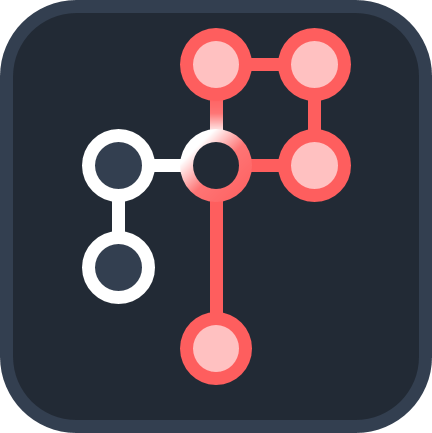

<h1 align="center">
  <br>
  miniPoly
</h1>

<p align="center">
  <a href="https://github.com/nash-yzhang/miniPoly/actions/workflows/tests.yml"></a>
  
  
  
</p>

Build multiprocess closed-loop rigs in Python: one OS process per device, each on its
own sub-millisecond tick.

Processes share state through a **schema-free shared-memory namespace** — declare any
key at runtime and any peer can read it by name, with no registry, no message type and
no central manager. That one property is what makes a new sensor become a shared state,
a CSV column and a live plot without touching anything else.

miniPoly runs the calcium-imaging + VR rig it was built for, and everything below is
measured on that rig rather than projected.

## The smallest complete rig

Two processes. The sensor publishes a state; the follower reads it by name and takes the
rig down. There is nothing else — no config file, no manager process, no schema.

```python
from miniPoly.compiler.prototypes import AbstractCompiler
from miniPoly.processor.prototypes import AbstractAPP
from miniPoly.processor.Logging import LoggerMinion


class Sensor(AbstractCompiler):
    def __init__(self, processHandler):
        super().__init__(processHandler)
        self.create_state('reading', 0.0)     # any key, at runtime, no schema
        self._n = 0

    def on_time(self, t):                     # called every tick, in its own process
        self._n += 1
        self.set_state('reading', self._n * 0.5)


class Follower(AbstractCompiler):
    def on_time(self, t):
        reading = self.get_state_from('SENSOR', 'reading')     # attach by name
        if reading is not None and reading >= 50:
            self.set_state_to('SENSOR', 'status', -1)
            self.shutdown()


if __name__ == '__main__':
    logger = LoggerMinion('LOGGER')
    sensor = AbstractAPP('SENSOR', Sensor, refresh_interval=1)        # 1 ms tick
    follower = AbstractAPP('FOLLOWER', Follower, refresh_interval=1)
    follower.connect(sensor)
    for minion in (sensor, follower):
        minion.attach_logger(logger)
    logger.run(); sensor.run(); follower.run()
```

Runnable as [examples/two_minions.py](examples/two_minions.py).

Those last five lines — construct, `connect`, `attach_logger`, `run` — are the same for
every rig, so a real application does not write them. **An application is a TOML file**:
`miniPoly.launcher` builds the same thing from a file naming the minions, their compilers,
the connect graph and the start order, and `Application.launch(path)` is the whole of the
Python. There is no class to subclass — as of 1.1, not even for the two things that used
to need one. See [examples/two_minions_config.py](examples/two_minions_config.py) and
[examples/two_minions.toml](examples/two_minions.toml).

Note what is passed to `AbstractAPP`: the compiler **class**, not an instance. It is
constructed inside the child process, which is what lets Qt / vispy / ctypes objects
live inside a minion at all under Windows `spawn`. That split — process shell in the
parent, logic in the child — is the framework's one structural constraint, and
everything else follows from it.

## What you get

- **A process per device, each with its own tick.** `refresh_interval` is per minion, so
  a camera at 20 ms and a servo loop at 1 ms coexist without either pacing the other.
- **A schema-free state namespace.** Arbitrary runtime string keys holding heterogeneous
  values (str, float, bool, None, list, nested dict, every numpy scalar dtype). Peers
  attach by OS-global shared-memory name, so a state declared in a child is readable
  from any process that connected to it.
- **Shared ndarray buffers** for what does not belong in a state — camera frames, OpenGL
  framebuffer reads.
- **Recording as part of the framework, not of your experiment script.** Flip one state
  and every participating minion writes its own timestamped CSV, plus `.avi`/`.bin` for
  each buffer, all against a single time base.
- **No fixed roles.** `timer_minion` (the clock) and `trigger_minion` (the control
  source) are constructor arguments, not types. Any minion can be either, and a rig with
  neither is legal.
- **Batteries for real hardware**: Dynamixel servos with a closed loop, optical-mouse
  displacement sensors, serial devices, a Qt GUI toolkit, a vispy/OpenGL renderer and a
  logging process. Cameras come as `AbstractCameraCompiler`, which owns the streaming,
  buffering and recording and leaves six hooks for a vendor SDK — the concrete
  The Imaging Source implementation, with its bundled DLLs, lives in the application
  repository rather than here, since a vendor binary is not rig-agnostic.

## Measured, on the rig

Best-of-N, real per-minion payloads from a recorded session, before-and-after in the
same run. Method and provenance: [docs/PROJECT_OVERVIEW.md](docs/PROJECT_OVERVIEW.md)
section 2.

| operation | cost |
|---|---|
| read a peer's scalar state (the dominant pattern, every minion every tick) | **7.5 us** |
| write a whole tick's 12 states | **21 us** |
| 1 ms tick in a real minion, fire-to-fire | **median 1.002-1.003 ms** |
| per-iteration loop overhead | **1.6 us** |

The tick loop **spins and never sleeps**, which is why the p99 is what it is. That was
not a default: `time.sleep` on this platform has an unbounded tail (~30 ms outliers that
appear even when idle), and thread priority, MMCSS and power-throttling settings were all
measured and changed nothing outside the noise floor. Section 2.3 has the tables. The
cost is a core per minion — see *Known limitations*.

## Installation

miniPoly is managed with [uv](https://docs.astral.sh/uv/). Install uv first:
```
powershell -ExecutionPolicy ByPass -c "irm https://astral.sh/uv/install.ps1 | iex"
```

### Use miniPoly in your own project
```
uv add git+https://github.com/nash-yzhang/miniPoly.git
```
Or, without a project, install it as a tool dependency of a throwaway env:
```
uv pip install git+https://github.com/nash-yzhang/miniPoly.git
```
The optional `full` extra pulls in the wider scientific stack (h5py, matplotlib,
scipy, tifffile, Pillow, openpyxl, paramiko, pyqtgraph) that miniPoly itself does
not import but experiment scripts commonly do:
```
uv add "miniPoly[full] @ git+https://github.com/nash-yzhang/miniPoly.git"
```

### Develop miniPoly
```
git clone https://github.com/nash-yzhang/miniPoly.git
cd miniPoly
uv sync --extra full
uv run python -m pytest -q
```
`uv sync` creates `.venv`, installs the locked dependencies from `uv.lock` and
installs miniPoly itself in editable mode. Run anything inside that env with
`uv run`, e.g.:
```
uv run python your_experiment.py
```
Common tasks:
| Task | Command |
| --- | --- |
| Add a dependency | `uv add <package>` |
| Remove a dependency | `uv remove <package>` |
| Refresh the lock file | `uv lock` (add `--upgrade` to bump versions) |
| Build sdist + wheel | `uv build` |
| Use a different Python | `uv sync -p 3.12` |

* Requires Python >= 3.9; developed and tested on 3.10/3.11 (`.python-version`
  pins 3.11 as the default for `uv sync`).
* The lock file is resolved with `win_amd64` as a required environment, since the
  bundled camera bindings (`miniPoly/tisgrabber`) are Windows-only.

## Tests

```
uv run python -m pytest -q          # six modules, a few seconds
```

Worth knowing what those checks are, because two of them are unusual and they are the
reason the numbers above can be quoted at all:

- **Every regression check was verified to fail against the pre-fix code.** Not "written
  after the fix and observed to pass" — actually run against the broken version first.
  That is the only thing separating a regression test from a permanent green light, and it
  caught a check that was too loose more than once.
- **`tests/test_core_multiprocess.py` carries a `KNOWN_DEFECTS` baseline**: defects that
  are *not* fixed yet and must keep reproducing. The suite fails if one stops, which turns
  a half-fix into a red build instead of a quiet pass, and forces the entry to be promoted
  into a real contract check when it is genuinely closed.
- `tests/test_public_surface.py` snapshots each module's public names, so an accidental
  namespace leak shows up as a diff. It has caught one three times.
- `tests/test_layering.py` is pure AST and imports nothing, so it still runs when the
  device dependencies are unavailable.

## Known limitations

Read these before adopting it. None of them is a bug report; they are the shape of the
design and the state of the work.

- **One core per minion.** The tick loop spins, so a running minion holds a core at
  ~99 % whatever its interval. Eight minions needs an eight-core-plus machine. This buys
  the timing above and there is no way to have both — see section 2.3.
- **Windows in practice.** Nothing in `core/` is Windows-specific, but the bundled camera
  bindings are Windows-only DLLs and `uv.lock` is resolved for `win_amd64`. It has only
  ever been run on Windows 10/11.
- **Single machine.** Shared memory means no network transport. For a rig spread across
  hosts, look at Lab Streaming Layer or ZeroMQ instead.
- **The state namespace is for state, not for bulk data.** One 8 KB JSON segment per
  minion, rewritten as a whole on flush. Frames and traces belong in a shared ndarray
  buffer, which is a separate, raw path.
- **The read-write lock is not finished.** Writer-versus-writer exclusion is an atomic
  compare-and-swap, and a write no longer advertises itself as a reader. But there is
  **no reader count**, so a writer can still enter while a second reader is inside the
  critical section. It is tracked, reproduced by a permanent baseline check
  (`KNOWN_DEFECTS` in `tests/test_core_multiprocess.py`), and documented in
  `PROJECT_OVERVIEW.md` 4-A4. Genuine multi-reader use is the case to be careful with.
- **One consumer so far.** The API has been shaped by exactly one application, there is
  no release on PyPI, and it is not versioned for external stability yet. Pin a commit.
- **A crashed minion can still look alive.** A segment outlives its owner, so a process
  killed outright keeps reporting its last status. There is a heartbeat primitive for
  detecting that, but nothing consumes it yet, and shutdown is bounded by a timeout
  rather than by knowing.

## Documentation

[docs/PROJECT_OVERVIEW.md](docs/PROJECT_OVERVIEW.md) covers the architecture, the
APP/Compiler split, the shared-memory design intent, measured core costs, the graded
defect inventory and the roadmap.

Two conventions in it worth knowing about. Every performance figure names
the single operation it was measured on and carries its provenance, because several of
them were wrong before they were right — section 2.2 says which and why. And defects are
graded by whether the active code path can actually reach them, so a serious-looking
entry in a class nobody calls is not treated as urgent.

Read the design-intent note in section 2.2 before changing anything under
`miniPoly/core/`.
