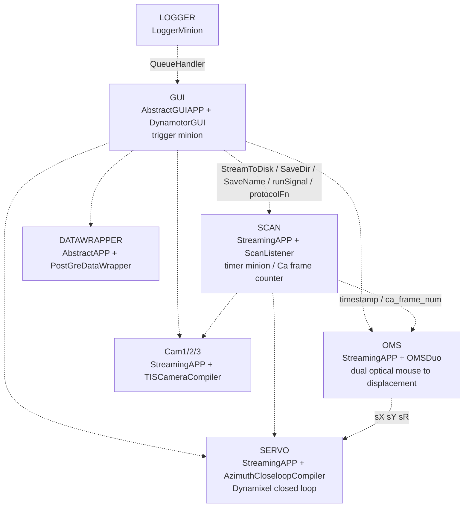

# miniPoly / miniPolyApp Project Overview

> Scope: an integrated analysis of `miniPoly` (the framework library) and
> `miniPolyApp` (its only consumer).
> Every item marked "verified" comes from an actual probe run or an actual
> cross-repository grep, not from static inspection.
> Baseline: miniPoly `e3acac7` (branch `overhaul`) + roadmap Stages 1 and 2 (complete),
> Stage 3 (complete except items 12/13, which are blocked) and Stage 4 item 19;
> miniPolyApp at the matching commit + the same.
> Section 6 records what each stage changed; section 4 marks each defect closed.
> Section 6's Stages 4 and 5 are the application-side work: Stage 4 is the half the
> library items cannot land without, Stage 5 is the application's own debt.

---

## 1. How the two repositories relate

```
miniPoly (library)                     miniPolyApp (application)
├── core/          process + shared memory primitives  <-- never used directly;
│                                                          always via processor/
├── processor/     process shells (the APP layer)      <-- instantiated by every
│                                                          app_setter entry point
├── compiler/      rig-agnostic compiler base classes  <-- heavily subclassed
├── contrib/       rig-specific implementations        <-- MotorShieldCompiler
├── util/          Qt tables, quaternions, GL helpers  <-- DataframeTable / qnum /
│                                                          GLRenderer imported directly
└── tisgrabber/    TIS camera ctypes bindings          <-- called directly for
                                                          camera enumeration
```

How the dependency is declared (rewritten 2026-08-06 by Stage 5 item 24): the application
is an installable package. `miniPolyApp/pyproject.toml` names
`miniPoly @ git+https://github.com/nash-yzhang/miniPoly.git@main` among its
dependencies, `uv.lock` pins the resolution, and an editable install is what makes
`CaImg_App` / `GL_App` importable. Until that day there was no `pyproject.toml`, no
lockfile and no README, and each entry script located its own package with
`sys.path.append(../..)`; the `requirements.txt` that carried the declaration is gone.

The application repository has two active Python trees:

| Tree | Status |
|---|---|
| `CaImg_App/` | The live calcium-imaging and VR application. |
| `GL_App/` | A standalone current-architecture replacement for the original `GL_test_app.py`: a Qt renderer controller and an independent VisPy display minion with dynamic `Renderer(canvas)` loading. |

> The original top-level `GL_test/` mattered out of proportion to its size: a
> reference scan that covered only `CaImg_App/` wrongly concluded that
> `miniPoly/util/display.py` was dead code. That mistake was made and reversed during
> the boundary work. The active replacement now
> keeps the dependency visible under `GL_App/renderer/planeAnimator.py`.
>
> **Correction, 2026-08-04.** Earlier versions of this table listed a third tree,
> `archive_code/`, holding the legacy `APP/GL_test/` "retained for reference". **No such
> directory exists**, in either repository or anywhere beside them (verified by `find`).
> What remains is `miniPolyApp/GL_test/`, an **empty** directory that git never tracked
> (`git ls-files GL_test` -> 0), so the legacy tree is not recoverable from history
> either -- it was deleted, not archived. `tests/test_app_imports.py` still lists
> `archive_code` in `EXCLUDED_PARTS` and its docstring still describes it, so that
> exclusion currently matches nothing. Removing the empty directory and the stale
> exclusion is Stage 5 item 25. Nothing else rests on this: the dependency the legacy
> tree documented is carried by `GL_App/renderer/planeAnimator.py`, which is live.

### The core design pattern: the APP / Compiler split

Every functional unit in miniPoly is cut in half:

| Layer | Location | Responsibility | Runs where |
|---|---|---|---|
| **APP** (= Minion) | `processor/` | Owns the process, the timer and the shared-memory segments | Constructed in the parent, run in the child |
| **Compiler** | `compiler/`, `contrib/` | Business logic; borrows the APP's capabilities through a mixin | Constructed only inside the child |

`AbstractAPP('NAME', SomeCompiler, **kwargs)` -- the compiler **class** is passed in
and only instantiated inside the child process's `initialize()`
([processor/prototypes.py:16-21](../miniPoly/processor/prototypes.py#L16-L21)). This
exists to work around the fact that Qt / vispy / ctypes objects are not picklable
under Windows spawn, and it is the single most important structural constraint in the
framework.

All application extension happens on the Compiler side:

```
StreamingCompiler (miniPoly)
├── TISCameraCompiler (miniPoly) ──── (UDP_TIS_Cam was here; the UDP path was removed 2026-08-06)
├── ShaderStreamer (miniPoly) ─────── CloseloopShaderStreamer (app/GUIs/graphic.py)
├── OMSDuo (miniPoly) ─────────────── OMSVR (app/prototypes/IO.py)
├── SerialCommandCompiler → MotorShieldCompiler (miniPoly/contrib)
│                            └── VWStimCompiler → CloseLoopStimCompiler → … (app/prototypes/Motor.py)
├── ScanListener (app/prototypes/IO.py)          <- the time base source
└── DynaMotorCompiler (app/motor/dynamixel.py)
    └── AbstractCloseloopCompiler → AzimuthCloseloopCompiler (app/motor/closelooper.py)

QtCompiler (miniPoly) ─── BaseGUI → BaseGUI_ICCam → ServoMasterGUI → DynamotorGUI (app)
AbstractCompiler (miniPoly) ─── DataWrapper / PostGreDataWrapper (app)
```

---

## 2. Runtime architecture

### 2.1 Process topology (current main entry point `app_setter/VR_init.py`, 2025-07-31)



Three role conventions (`timer_minion` and `trigger_minion` are constructor arguments,
not part of any type system):

- **timer minion = `SCAN`**: the single authoritative time source. `ScanListener`
  parses `---<us>,<x>,<frame>+++` off an Arduino serial port and writes the shared
  state `timestamp`. Every compiler's `get_timestamp()`
  ([compiler/prototypes.py](../miniPoly/compiler/prototypes.py)) reads it and divides by
  1000.
- **trigger minion = `GUI`**: the single control source. `StreamToDisk`, `SaveDir`,
  `SaveName`, `runSignal`, `protocolFn`, `fullscreen` are all owned by the GUI and
  polled by everyone else.
- **logger**: `attach_logger()` swaps each minion's root logger for a `QueueHandler`
  pointing at the logger's queue.

All of these state names are now defined in one place,
[core/contract.py](../miniPoly/core/contract.py); the `APP_*` group marks the ones where
the library reads an application convention.

### 2.2 Two inter-process channels

| Channel | Implementation | Used for |
|---|---|---|
| **Shared state** (the workhorse) | `SharedDict` = JSON serialised into an 8 KB shared-memory segment | Scalars, strings, protocol paths, control flags |
| **Shared buffer** | `SharedNdarray` = raw shared memory + a 512 B header | Camera frames, FBO preview frames |
| Queue (barely used) | `mp.Queue` | Only logging records |

Naming convention: a `SharedDict` value beginning with `b*` means "this is the name of
a `SharedNdarray`", and reads are transparently redirected
([core/minion.py](../miniPoly/core/minion.py)). `create_state(..., use_buffer=True)` routes
a state onto that path; `FRAMEWORK_STATUS` already uses it.

Locking is **per segment**, on a lock byte in that segment's own header. The global
`SHAREDLOCK` ([core/minion.py:43](../miniPoly/core/minion.py#L43)) is *not* on the
read/write path -- `SharedDict` is constructed with `use_RWLock=True`
([core/buffer.py:550](../miniPoly/core/buffer.py#L550)), so `read`/`write` take the
`aquire_RWlock` branch and `self._lock` is only touched in `_write_header` /
`_read_header` at construction time.

### Design intent (read this before proposing changes to `core/`)

Both mechanisms look like naive implementations and are not.

**Why JSON, not a packed binary record.** The requirement is a *schema-free* state
namespace: any process declares a state at runtime under an **arbitrary string key** --
csv/xlsx column names, config-derived `motor_dict` keys -- holding a heterogeneous value
(str, float, bool, None, list, nested dict), with no declaration step, no central
manager and no hard-coded key list. `SharedDict` delivers exactly that, and it works
from inside the child process because `shared_memory.SharedMemory` names are OS-global,
so peers attach by name in `link_minion`.

This is load-bearing, not incidental: `motor_dict` keys in `VR_init.py` become state
names become CSV column names (`SERVO_dynamotor_x` in the 2025-11-28 session's SERVO
stream), and `DynamotorGUI` builds its live
plots from a runtime `surveillance_state` dict, dispatching on `type(val)` read back out
of shared memory. **Any proposal that imposes a schema -- fixed-length name slots, type
codes, fixed value widths -- destroys the property the design exists for.**

**Why a read-write lock.** Multi-reader / multi-writer is a design goal, not an accident:
`set_state_to` writes into a peer's segment at 39 sites in the application, and
`aquire_RWlock` already distinguishes `'r'` from `'w'`. This rules out a seqlock
(single-writer only) as a replacement.

### Measured cost of the current core

All figures best-of-5, single process, uncontended, from
[tests/test_serialization.py](../tests/test_serialization.py) (codec) and
[tests/test_core_multiprocess.py](../tests/test_core_multiprocess.py) `--perf` (real path),
using the real per-minion payloads transcribed into that module.

> **On the session data cited throughout this document.** Several findings below are
> evidenced by one real recording session on the rig (2025-11-28, `animal_id` "test123").
> Its raw CSVs, `_INFO.json` and 64 000-line log used to be tracked under
> `tests/test_supp_data/`; they were removed before this repository was published,
> because the log carries the rig's network identity (host, share, SSH details) and the
> protocol paths name a colleague's unpublished experiment. Every value those files
> contributed is transcribed into [tests/test_serialization.py](../tests/test_serialization.py)
> and into the quoted excerpts here, so each claim stays checkable; the raw files remain
> on the lab share for anyone who needs to re-derive them.

| operation | before Stage 2 | **now** (items 9 + 10) | with a per-entry redesign |
|---|---|---|---|
| **Foreign scalar read** (`get_foreign_state`, the dominant pattern) | 118.6 us | **7.5 us** | 1.4 us |
| -- the same read, one refresh rather than two | 58.5 us | **3.7 us** | -- |
| `SharedBuffer.read()` on an 8 KB segment | 85 us | 3.4 us | -- |
| SERVO's 12 state writes in one tick, no peers | 1054 us | **21 us** | ~7 us |
| -- the same, 3 and 7 peers reading | see below | 6.5-14.9x better | -- |
| Lock acquire + release | **1.71 us** | 1.71 us | **15.7 us** |
| Empty tick boundary (every non-writing iteration) | -- | **0.06 us** | -- |

Every figure in the "now" column is **measured, not projected** -- `--perf` on
`tests/test_core_multiprocess.py` plus the uncontended write bench, before and after in
the same session, best of three. The third column remains a projection.

Three figures in earlier versions of this table were wrong. All three were baselines
carried over from a different measurement rather than re-measured, and two of them were
off by more than the change they were used to justify:

- The foreign read was given as 179 us with 3.9 us predicted after. The *prediction* was
  right (3.7 us measured); the baseline was not -- re-measured immediately before the
  change it was 118.6 us. So the ratio is ~16x, not ~46x.
- **SERVO's 12 writes were given as 88 us. 88 us was the cost of *one* `set_state`**, and
  twelve of them cost 1054 us. `BaseMinion.set_state` performed three shared-memory
  operations per key, not one: `key in self._shared_dict.keys()` was a full `_refresh()`,
  `self._shared_dict[key]` (the `b*` prefix test) a second, and the assignment re-encoded
  the whole dict. So a tick was 24 full decodes plus 12 full encodes.
- Item 10 was then projected to reach ~7 us. It reaches 21 us, because the model measured
  a bare refresh-overlay-write and skipped the 12 rounds of Python call overhead the real
  `set_state` path pays. **A model of the fast path is not a measurement of it.**

Measure the before and the after in the same run; count the operations at the call site
before pricing them; and when the projection and the implementation disagree, re-measure
the implementation rather than quoting the projection.

#### The write side, measured under contention

The single-process figures above are uncontended upper bounds. `measure_contended_writes`
in [tests/test_core_multiprocess.py](../tests/test_core_multiprocess.py) runs the owner at a
real 1 ms tick writing SERVO's 12 keys while N peers read the same segment throughout,
and prices both sides.

**Read the absolute numbers with care; trust the ratio.** Nine runs in one session, with
the rig at ~30 % ambient CPU from unrelated work, gave a per-key cost anywhere from 357
to 1612 us for the identical measurement, drifting upward as the session went on. The
*ratio* stayed put, because both regimes are measured inside the same run seconds apart,
so ambient load largely cancels:

| peers reading | owner, per-key writes (today) | owner, batched | ratio |
|---|---|---|---|
| 0 (single process) | 241 us per tick | 9.8 us | 24.7x |
| 3 | 357-868 us (7 runs) | 29-94 us | 8.1-12.7x |
| 7 | 1542 / 1612 us | 147 / 137 us | 10.5 / 11.8x |

**Batching the write side is worth ~11x under contention** (median of nine runs; 24.7x is
the uncontended ceiling and should not be quoted as the expected gain). The absolute cost
is a large fraction of SERVO's 1 ms tick under every condition measured -- 36 % at best,
and at N=7 the per-key path needs **more than the whole tick**, so the write path alone
cannot keep up with seven peers reading. Batched, the same work is ~14 % of the tick.
Before item 9 it was 1054 us uncontended, i.e. already over budget with no peers at all.

An earlier draft of this section quoted "357 / 384 / 395 us" at N=3 and 566 us at N=7 and
concluded "SERVO spends more than half of its 1 ms tick". Those three N=3 values are not
reproducible -- they are the low end of a much wider spread -- and the derived fraction
inherited their spurious precision. **Report the paired ratio and the observed range; do
not quote a single-run absolute from a machine with ambient load.**

Two things this measurement cannot settle, and one it settles the other way:

- **Reader cost is flat across regimes** -- in every one of the nine runs the three
  reader phases (owner idle, owner writing per key, owner writing batched) came out
  within a few percent of each other, with no consistent ordering. That is not evidence
  that writes are harmless to readers; it is evidence that **the lock is not excluding
  anything**, which is exactly the two entries still in `KNOWN_DEFECTS` (no reader count,
  non-atomic test-and-set). Any reader-side benefit of batching can only be measured
  after item 15, so **item 10's case is entirely owner-side.**
- **Reader cost scales with the number of readers, not with writer activity** -- 8.7 us
  alone, 19-52 us with 3 peers, 82-100 us with 7. Readers contend with each other on the
  lock byte, and they do so even when the owner is completely idle.
- **Lock acquisitions per tick: 36 versus 2.** At today's incorrect-but-cheap 1.71 us
  that is a minor term. At the 15.7 us a correct `atomics` CAS costs it becomes **565 us
  versus 31 us per tick**, so batching is a precondition for affording item 15 at all --
  the same conclusion 2.2's budget constraint reaches from the other direction. This is
  the one argument here that does not depend on any contended timing being reproducible.

Decomposition of that 85 us read: **78 us was the NUL split**, 5.6 us `json.loads`,
1.4 us the copy and decode. `SharedDict`'s own dict rebuild costs only **0.51 us**. With
the split gone the codec is no longer a rounding error -- it is now roughly a third of a
read -- but that does not promote item 11, because `orjson` saves ~2 % of the *old* read
either way.

Three consequences that set the repair order in section 6:

1. **The codec was ~2 % of a real read.** A length prefix instead of the NUL terminator
   was worth ~16x on the foreign-read path; swapping `json` for `orjson` is worth ~2 %.
   The codec swap is therefore a *correctness* change (see B1), not a performance one.
2. **The current lock byte is cheap because it is incorrect.** 1.71 us is two slice
   operations with no atomicity. A correct `atomics.cmpxchg_strong` costs 15.7 us --
   **9x more**. Making the lock correct is a cost, not a saving.
3. **`atomics` is 10-40x more expensive than a plain slice** (`inc()` 3.87 us,
   `load()` 7.78 us, `cmpxchg_strong` 15.67 us, versus 0.41 us to read and 0.27 us to
   write four bytes), and `atomicview()` costs **27.6 us to open**, so a view must be
   opened once per segment per process and held, never per operation. An atomic may
   appear at most **once per tick per segment** -- never per key, never on a read path.
   A per-key generation counter would cost SERVO 12 x 3.87 = 46 us per tick, making
   writes *slower* than simply batching them.

> **Provenance warning.** This section's numbers have been wrong three times: once
> attributing the cost to the global lock, once calling the JSON round trip "the
> throughput ceiling" with no measurement, and once using a codec-only microbenchmark to
> rank the work. Each error came from inferring system behaviour from a microbenchmark.
> Treat any figure here as valid only for the single operation named, and re-measure
> before acting on it.

### 2.3 Tick pacing: why the loop spins, and why it must

`TimerMinion.exec()` compares `perf_counter()` against `self._interval` and fires the
callback when the interval has passed. `innerLoop` calls it in a loop with **no sleep**, so
every minion holds a core continuously. That is deliberate, and the reason is stronger than
"`time.sleep` is imprecise on Windows".

**What was measured** (Python 3.11.7, win32, 20 cores; full tables in the session record,
reproduced here because the conclusion is load-bearing):

| waiting method, 1 ms target | median | p99 | CPU |
|---|---|---|---|
| `time.sleep(0.001)` | 1.562 | 1.843 | **0.0 %** |
| pure spin on `perf_counter` | 1.001 | 1.022 | 98.7 % |
| hybrid: sleep the bulk, spin the tail | 1.001 | 1.008 | 104 % |
| `CreateWaitableTimerExW` + HIGH_RESOLUTION, by hand | 1.573 | 1.791 | 3.4 % |
| `NtDelayExecution` | 10.085 | 16.693 | 0.0 % |
| `mp.Queue.get(True, 0.001)` | 10.274 | -- | 0.0 % |

1. **CPython 3.11+ already uses the Win32 high-resolution waitable timer inside
   `time.sleep()`.** Calling it by hand is identical minus ctypes overhead, and
   `timeBeginPeriod(1)` makes **no difference** (1.576 vs 1.579) -- the classic
   15.6 ms-granularity remedy is obsolete here. That granularity problem is real on
   Python <= 3.10, which is one reason not to support those versions.
2. `NtDelayExecution` does **not** receive high-resolution treatment: 6x worse. Dead end.
3. The residual ~0.4-0.6 ms is **thread wake-up scheduling latency**, not timer resolution.

**A hybrid tick was built and rejected.** Sleeping `interval - margin` and spinning only
the tail cuts CPU hugely -- 98.8 % -> 8.6 % at a 10 ms tick, 98.6 % -> 4.5 % at 20 ms, with
an unchanged median fire interval -- and **nothing at 1 ms**, where the interval is below
the spin margin. It was rejected because the design needs a one-sided guarantee, overshoot
< margin, and Windows does not provide one. `sleep(18.8 ms)` overshoot over n=3000:
median 0.39 / p99 0.82 / p99.9 1.37 / **max 31.6 ms idle**, and 30.9 ms under saturation.
Raising the margin barely helps -- 1.2 -> 5.0 ms takes the late rate from 1-in-250 to
1-in-3000 while the worst lateness stays 26-30 ms. That ~30 ms outlier **appears when idle
too**, so it is not a load effect and a faster machine does not fix it; no margin below
30 ms covers it, and a 30 ms margin on a 20 ms tick means never sleeping.

**No scheduling knob bounds it either.** Measured interleaved across 4 rounds x 400
samples per configuration, with each setting verified to have applied (baseline per-round
p99 spread 0.81-0.95 ms is the noise floor, so p99 differences under ~0.15 ms mean
nothing):

| configuration | median | p99 | p99.9 | max | late per 1000 |
|---|---|---|---|---|---|
| baseline | 0.416 | 0.856 | 1.096 | 1.881 | 0.6 |
| `THREAD_PRIORITY_TIME_CRITICAL` | 0.414 | 0.816 | 1.542 | 1.660 | 1.2 |
| `HIGH_PRIORITY_CLASS` + time-critical | 0.413 | 0.873 | 1.302 | 4.962 | 1.2 |
| `NtSetTimerResolution` 0.5 ms | **0.289** | 0.840 | 2.664 | 3.482 | 5.6 |
| power throttling disabled | 0.414 | 0.911 | 2.660 | 3.758 | 3.8 |
| MMCSS "Pro Audio" | 0.401 | 0.868 | 1.697 | 1.845 | 1.2 |
| MMCSS + HIGH + time-critical | 0.404 | 0.829 | 0.999 | 1.032 | 0.0 |
| all of the above | 0.280 | 0.676 | 2.216 | 2.248 | 1.2 |

Priority, MMCSS and power throttling change **nothing** outside the noise floor.
`NtSetTimerResolution(0.5 ms)` genuinely halves the *typical* overshoot -- the one real
effect -- but every configuration still has p99.9 above 1 ms. `REALTIME_PRIORITY_CLASS`
needs a privilege this account does not have (the call silently yields `HIGH`).

So **sub-millisecond typical is achievable (~0.28 ms median, 0.68 ms p99); sub-millisecond
guaranteed is not.** Windows is not an RTOS and exposes no API that bounds wake-up latency;
MMCSS is the closest thing available and did not remove the tail. Spinning is the only
mechanism that offers the guarantee, because a thread that never sleeps has no wake-up
latency at all. That is what `exec()` does, and it should stay.

> Two caveats on this evidence, both of which cost real time to learn. First, the ~30 ms
> outlier was seen twice in n=3000 runs and **not once** in the interleaved run above
> (1600 samples per configuration), so it is episodic and **no configuration was shown to
> prevent it** -- absence at this sample size is not evidence. Second, the spin variant was
> only measured over 400 ticks, too few to catch a 1-in-3000 event, so it is not
> established that spinning has no comparable tail; what is established is that the sleep
> path demonstrably has one. Two earlier attempts at the priority table were discarded
> outright: the first silently applied nothing (HANDLE-returning functions left at ctypes'
> default `int` restype truncate the 64-bit pseudo-handles), and the second applied its
> settings but ran configurations back to back, so background load landed on whichever ran
> first and the baseline's p99 came out 20x worse than the same baseline minutes earlier.
> **Verify that a setting took effect, and interleave.**

#### The cost that *was* removed: the per-iteration status read

`innerLoop` used to run `STATE = hook.status` every turn, and that is a real
`SharedNdarray.read()` -- take the lock byte, copy the array, release. It is now
rate-limited by `BaseMinion.STATUS_POLL_INTERVAL` (5 ms).

Measured **in situ**, by counting loop iterations between callback fires, before and after,
median of three runs per interval:

| interval | iterations per tick | per iteration | status reads/s |
|---|---|---|---|
| 1 ms, before | 333 | 2.94 us | ~333 000 |
| 1 ms, after | **616** | **1.62 us** | **200** |
| 10 ms, before | 3398 | 2.94 us | ~340 000 |
| 10 ms, after | **6329** | 1.58 us | **200** |
| 20 ms, before | 6774 | 2.95 us | ~339 000 |
| 20 ms, after | **12 555** | 1.59 us | **200** |

So the read was ~1.3 us of a ~2.9 us iteration, the loop now runs ~1.85x more often, and
status-segment lock traffic drops by roughly **1700x**. Consequences:

- The sub-millisecond guarantee is untouched: the loop still spins and never sleeps.
- The tick gets *finer*, not coarser. Jitter at a 1 ms interval improved from
  0.067-0.172 ms to 0.006-0.050 ms across three runs each; at 10 and 20 ms it was already
  at the noise floor and stayed there (p99 10.008 vs 10.006, 20.017 vs 20.008).
- It relieves exactly the contention that making `SharedNdarray.write()` take the write
  lock (A4) introduced: a peer writing this minion's status during shutdown no longer has
  to find a gap between hundreds of thousands of acquisitions per second.
- **CPU occupancy is unchanged at ~99 %.** The thread still spins. Nothing lowers that
  without sleeping, and sleeping is what the tail above rules out.

The price is that a status change -- shutdown, suspend -- is noticed up to
`STATUS_POLL_INTERVAL` later instead of within microseconds. A fixed 5 ms bound was chosen
over "once per tick" so the guarantee does not degrade as the interval grows: a camera at
20 ms still reacts within 5 ms. Pinned by `check_status_poll_stays_responsive` in
[tests/test_failure_paths.py](../tests/test_failure_paths.py).

> **This entry was wrong once, in the direction section 2.2's provenance warning predicts.**
> It first claimed the status read was 7.66 us and 89 % of an iteration, from a
> microbenchmark of `read()` in isolation. The in-situ measurement contradicts it outright:
> the whole iteration was only 2.94 us, so the isolated benchmark overstated the read by
> ~6x. Counting iterations inside the real loop is the measurement that counts. A first pass
> at that measurement also had to be thrown away -- it multiplexed variants through one
> `mp.Queue` and mislabelled its own rows -- and a single 1 ms run showed jitter 0.430 ms
> and an impossible 1-iteration gap, which three repeats showed to be noise. **Repeat before
> believing a single run.**

### 2.4 The streaming (to-disk) chain

```
GUI sets StreamToDisk=True
  -> each compiler's _streaming_setup() sees the edge via watch_state
  -> should_stream() decides whether this minion participates
     (cameras filter on the GUI's StreamingDevices list)
  -> _prepare_streaming() validates directory / name collisions
  -> _start_streaming() opens files
  -> _streaming() writes one csv row per tick (+ each buffer to .bin/.avi)
  -> GUI sets False -> _stop_streaming() closes everything
```

Each minion produces `{SaveName}_{minion}.csv` plus
`{SaveName}_{minion}_{minion}_{buf}.avi` -- the minion name appears twice because
`file_name` is already `SaveName + "_" + self.name`
([compiler/prototypes.py:246](../miniPoly/compiler/prototypes.py#L246)) and the buffer
paths interpolate `self.name` a second time
([:266](../miniPoly/compiler/prototypes.py#L266),
[:274](../miniPoly/compiler/prototypes.py#L274)). Cosmetic, and it changes file names on
disk, so it is grouped with the other streaming-chain repairs in roadmap item 17.
(Earlier versions of this line pointed at 4-C7, which is a different defect --
`SharedDict.update()` popping while iterating.)
`PostGreDataWrapper` then pushes the files to a remote host and registers them in
PostgreSQL.

---

## 3. Module inventory and lifecycle status

"Refs" = number of active miniPolyApp files referencing the symbol, scanned from the
**repository root**, excluding `__arc__` and `drafts`. (`test_app_imports.py` also
excludes `archive_code`, which no longer exists -- see the correction in section 1.)

### 3.1 Active (reachable from the current entry point `VR_init.py`)

| Module | Symbols | Refs | Notes |
|---|---|---|---|
| `core/minion.py` | `BaseMinion` `TimerMinion` `AbstractMinionMixin` `TimerMinionMixin` `MinionLogHandler` | 0 direct | **All active through inheritance**; the foundation of the whole framework |
| `core/buffer.py` | `SharedBuffer` `SharedNdarray` `SharedDict` | 0 direct | as above |
| `core/contract.py` | shared-state key names | -- | Added by the boundary work; the single definition point |
| `processor/Streaming.py` | `StreamingAPP` | 15 | The most-used APP shell |
| `processor/Logging.py` | `LoggerMinion` | 13 | Every entry point |
| `processor/GUI.py` | `AbstractGUIAPP` | 12 | |
| `processor/prototypes.py` | `AbstractAPP` | 11 | |
| `compiler/cameras.py` | `TISCameraCompiler` | 10 | |
| `util/qnum.py` | quaternion / rotation helpers | 9 | **Not dead code** (see the warning below) |
| `compiler/serial_devices.py` | `OMSDuo` `OMSInterface` | 7 | Module name kept for import compatibility although it now holds only OMS classes |
| `compiler/graphics.py` | `QtCompiler` | 6 | Base class of every GUI |
| `compiler/prototypes.py` | `StreamingCompiler` `AbstractCompiler` | 4 | |
| `util/gui.py` | `DataframeTable` `DataframeModel` | 4 | **Not dead code** |
| `tisgrabber/` | `tisgrabber` | 3 | Called directly for camera enumeration |
| `util/display.py` | `GLRenderer` | 1 | Used by `GL_App/renderer/planeAnimator.py`; sphere defaults remain archive-only |

> **Two warnings about reference counting.**
>
> A single-repository scan judged `util/qnum.py` (796 lines) and `util/gui.py`
> (239 lines) to be dead code. **That conclusion was wrong.** They have no references
> inside miniPoly but are used by 13 application files
> (`prototypes/GUI.py`, `prototypes/dockableGUI.py`, `motor/dynamixel.py`, and seven
> stimulus scripts).
>
> Worse, a scan restricted to `CaImg_App/` judged `util/display.py` dead, and it was
> archived before the mistake was caught. Five files under the former top-level
> `miniPolyApp/GL_test/renderer/` imported `GLRenderer` from it. That legacy tree is
> **gone** -- not archived; see the correction in section 1 -- and the live consumer is
> now `GL_App/renderer/planeAnimator.py`.
> `miniPolyApp/tests/test_app_imports.py` still scans from the repository root while
> excluding `__arc__` and `drafts`.

### 3.2 Active only in older entry points (retained for historical configurations)

| Symbol | Location | Last-using entry point |
|---|---|---|
| `ShaderStreamer` | `compiler/graphics.py` | `visual_testing.py` (2024-07-15), via `CloseloopShaderStreamer` |
| `StreamingGLAPP` | `processor/Streaming.py` | `visual_testing.py` |
| `OMSInterface` | `compiler/serial_devices.py` | `main.py` / `tactileFullVR.py` |
| `MotorShieldCompiler` `SerialCommandCompiler` | `contrib/motorshield.py` | `main.py` etc, via `prototypes/Motor.py` |

The current entry point `VR_init.py` has moved its visual stimulus path from OpenGL
shaders to a Dynamixel servo closed loop (`AzimuthCloseloopCompiler`), so the shader
side is "working but not current".

### 3.3 Archived (zero references across both repositories)

Moved to `miniPoly/__arc__/`, which is gitignored in this repository (history remains
reachable via `git log --follow`). See `miniPoly/__arc__/README.md`.

| Symbol | Original location | Lines |
|---|---|---|
| `IOStreamingCompiler` | `compiler/prototypes.py` | 287 |
| `PololuServoInterface` | `compiler/serial_devices.py` | 235 |
| `GLCompiler` | `compiler/graphics.py` | 174 |
| `ArduinoCompiler` | `compiler/serial_devices.py` | 45 |
| `AbstractGLAPP` | `processor/GL.py` (whole file) | 21 |
| `TisCamApp` | `processor/cameras.py` (whole file) | 14 |

Defects inside these classes should not be fixed; they were removed with the code.
See 4-D.

On the application side, `CaImg_App/__arc__/` (which **is** git-tracked) received the
dead `GLGUI` from `GUIs/servo.py`, the legacy `BaseGUI`/`BaseGUI_ICCam` from
`prototypes/GUI.py`, the two already-broken entry points, and the diverged `qnum`
fork.

---

## 4. Defect inventory, graded by whether the active path can actually trigger it

This grading is the main correction the integrated analysis brought over a
single-repository one: a batch of apparently serious defects sit in classes that are
never reached, while another batch is quietly worked around on the application side.

### A. Active, already worked around in the application (design debt: bug in the library, patch in the app)

**A1. A shared streaming buffer only ever writes its first frame** -- severity: high -- **FIXED 2026-08-04, roadmap Stage 1 item 4**

When `create_streaming_buffer(..., shared=True)`, `set_streaming_buffer()`
([compiler/prototypes.py](../miniPoly/compiler/prototypes.py)) wrote **only** the shared
state and never updated the local `_streaming_buffers[name][0]`, while `_streaming()`
writes `v[0]` straight to disk. The function that would refresh the local copy,
`get_streaming_buffer()`, is **never called anywhere in either repository** (verified
by grep). The initial frame was therefore written over and over.

- The library's "fix" was commit `c478595`
  (*"dirty workaround by creating a local buffer for streaming + a shared buffer for
  preview"*): it changed the **call pattern** of `TISCameraCompiler` (shared buffer for
  preview, local for streaming) without touching the bug.
- The application's `WebCamCompiler` passed `shared=True`
  ([app/prototypes/Camera.py:73](../../miniPolyApp/CaImg_App/prototypes/Camera.py#L73)),
  so it was affected, and carried the comment
  `# TODO: fix the bug that saves only the first frame the camera aquired`.

**The fix.** `set_streaming_buffer` now updates the local copy unconditionally and
writes the shared state as well when the buffer is shared. The app-side TODO is
resolved; the stray `print()` next to it is gone too. `TISCameraCompiler`'s
double-buffer workaround is now **redundant but deliberately kept**: collapsing it to a
single `shared=True` buffer cannot be verified without the TIS DLL and a camera
attached, and it would move `buffer_name` into `_shared_buffers`, which changes the
`remove_streaming_buffer` path on camera disconnect (near C14). A NOTE in
[compiler/cameras.py](../miniPoly/compiler/cameras.py) records what to collapse and what to
re-check when doing it on the rig. Pinned by
`check_streaming_buffer_updates_the_local_copy` in
[tests/test_failure_paths.py](../tests/test_failure_paths.py).

**A2. ~~The FBO frame's width and height are transposed~~ -- NOT A DEFECT; the original analysis was wrong** -- **resolved 2026-08-04**

The claim was that `ShaderStreamer` allocates its shared buffer as `(W,H,3)` while
`self._fbo.read()` returns `(H,W,3)`, and that the application's
`glframe.transpose([1,0,2])` compensates. **All three parts are wrong**, established by
reading vispy rather than by inspection:

- `gloo.RenderBuffer.resize`'s own docstring says its shape is **"in yx order"**, and
  `FrameBuffer.read` documents and returns `(h, w, c)`. `Texture2D` and `np.zeros` take
  rows first too. So every allocation on the path uses one and the same order, and the
  preview buffer's shape matches `read()`'s output exactly. Nothing was ever mismatched.
- The one caller,
  [visual_testing.py:46](../../miniPolyApp/CaImg_App/app_setter/visual_testing.py#L46),
  passes `max_screen_size=(480,800)` next to a `size=(800,480)` canvas -- it had already
  worked the order out and swapped by hand.
- The app-side transpose is a **pyqtgraph** convention, not a compensation: pyqtgraph's
  default `imageAxisOrder` is `'col-major'`, so `setImage` wants the x axis first, and
  the application never overrides it. `CaImg_App/tools/aviViewer.py:51` does the same
  transpose to plain cv2 frames, which is independent confirmation. (This point rests on
  pyqtgraph's documented default; pyqtgraph is not installed in miniPoly's venv, so it
  was not executed here.)
- `app/GUIs/servo.py:300`, the "second compensation", **no longer exists** -- it went with
  `GLGUI` during the boundary refactor.

The real defect at that site is the one the original entry called incidental:
`graphic.py:163-166` transposed *before* testing `if glframe is not None`, so a None from
`get_state_from` raised `AttributeError`. **Fixed** -- the None test now comes first.

What survives is a naming trap, not a bug: the parameter was called `max_screen_size`,
which reads as (W,H). It is now **`max_frame_shape`**, documented as (rows, columns),
with `_stream_out_size` renamed to `_max_frame_shape` to match. Behaviour is unchanged
and the one call site was updated. The default `(1920, 1080)` is portrait under this
order and was left alone, because changing a default is not behaviour-preserving and no
caller relies on it.

**A3. `get_timestamp()` does not accept an empty-string timer minion** -- severity: low -- **FIXED 2026-08-04, roadmap Stage 1 item 7**

The library only tested `is not None`. The application copied the whole method in
`app/motor/dynamixel.py:406` just to add `and self._timer_minion != ''`. The library now
makes that test, and the copy is deleted (along with the `perf_counter` import it was the
only user of). Pinned by `check_timestamp_accepts_an_empty_timer_minion`.

**A4. `SharedNdarray.write()` acquires the read lock** -- severity: high -- **FIXED 2026-08-04, roadmap Stage 1 item 5; the rest of the lock is not**

`aquire_RWlock('r')` should be `'w'`. Verified: while a write was in progress, both
another writer and a reader could enter, so a half-written frame was visible in the
preview. This is a **separate** defect from A1 (A1 corrupted what is written to disk,
A4 tore what is previewed); the `c478595` double-buffer workaround masked the
symptoms of both.

`write()` now takes `'w'`, and wraps the assignment in `try/finally` -- a shape or dtype
mismatch raises inside the critical section, which without the `finally` would strand the
lock byte at `'w'` exactly as B1 did. Both properties are pinned by
`check_ndarray_write_takes_the_write_lock`. **This does not make the lock sound**; it only
stops `write()` from advertising itself as a reader. The three remaining rows of the table
below are untouched and still reproduce in
[tests/test_core_multiprocess.py](../tests/test_core_multiprocess.py)'s `KNOWN_DEFECTS`.

Alongside it, the RW lock does not currently deliver the multi-reader / multi-writer
access it is aimed at (see the design-intent note in 2.2). Four separate defects,
listed with the condition that exposes each:

| Defect | Consequence | Exposed by |
|---|---|---|
| `_read_lockbyte` then `_write_lockbyte` is a non-atomic test-and-set | Two processes both see `' '`; one writes `'r'`, one writes `'w'` -> concurrent read and write | any contention |
| **No reader count**: `release_RWlock()` unconditionally writes `' '` | Readers A and B both enter; A finishes and unlocks; a writer sees the segment free and writes **while B is still reading** | **only genuine multi-reader use** |
| Spin loop has no sleep, and `timeout=1000` is a spin count, not a duration | Writer starvation plus a burnt core under contention | high contention |
| ~~`SharedNdarray.write()` acquires `'r'`~~ | Direct data race | **fixed 2026-08-04** |

All four are reproduced as a baseline by
[tests/test_core_multiprocess.py](../tests/test_core_multiprocess.py). The repair is roadmap
items 12-15; two constraints on it are worth stating here because they rule out the
obvious approaches: a **seqlock is not a substitute** (single-writer only, contradicting
the design goal), and the reader count needs genuine atomicity for its increment, which a
spin over a byte in shared memory cannot provide.

Ordering: B1 had to be fixed first, and now is. A raising write left the lock byte stuck
at `'w'` forever, and multi-writer use raises that probability.

### B. Active and not worked around (real risk)

**B1. An oversized `SharedBuffer.write()` raises while holding the lock, permanently deadlocking that minion's namespace** -- severity: high (verified) -- **FIXED 2026-08-04, roadmap Stage 1 item 1**

`SharedBuffer.write()` had no length check and no `try/finally`. When the write raised,
the segment's lock byte was left at `'w'` and never cleared, so **that segment was
unusable for the remaining life of the program**.

**Trigger.** Not size: SERVO's real dict, the largest in the topology, encodes to
**472 B against 8174 B usable** (5.8 %), so the 8 KB ceiling is 17x away. The realistic
trigger was a **numpy dtype**. `np.float64` subclasses Python `float`, so stdlib `json`
accepted it by accident; `float32`, `float16`, every `int*`/`uint*` and `bool_` all raised
`TypeError`. Every OMS and motor state is numpy-derived (`np.nanmean` in
[compiler/serial_devices.py](../miniPoly/compiler/serial_devices.py)), so one `dtype=`
change upstream turned into a raise inside `write()` -- **after** the data region had been
zeroed and **while** the lock byte was held. Verified identical under the rig's numpy
1.26.4 and under numpy 2.4.6.

**That trigger is now gone too (item 11).** The encoder takes all eight dtypes and returns
them as `int`/`float`/`bool`. So B1 is closed from both directions: item 1 made a failed
write harmless, and item 11 removed the thing that made it fail. What can still be
rejected is a value that is genuinely not a state -- an `ndarray`, which belongs in a `b*`
`SharedNdarray` -- and that is what the contract check now uses.

**Blast radius.** The owning minion could no longer read or write its own states, and every
peer polling it spun 1000 times in `aquire_RWlock`, warned, and received `None` --
indistinguishable from a legitimately absent state at every call site. Not global: the
lock byte is per segment. `SharedDict.__setitem__` swallows the traceback into a bare
`print`, so nothing reaches the logger; the failure was silent, destructive and permanent
for that segment.

**The fix.** `write()` now encodes and size-checks **before** it takes the lock or touches
the data region, and releases the lock in a `finally`. Both failure modes -- an
unencodable value and an oversized payload -- therefore leave the previous payload
readable, the lock byte free and the segment writable. The baseline check in
[tests/test_core_multiprocess.py](../tests/test_core_multiprocess.py) graduated from
`KNOWN_DEFECTS` into the contract check `check_failed_write_is_non_destructive`, which
was verified to fail against the pre-fix code.

Two residuals are deliberately left, both outside item 1's scope:
`SharedDict.__setitem__` keeps a rejected key in its **local** dict until the next
`_refresh()` rebuilds that dict from shared memory (self-healing on any read path, so no
permanent poisoning), and it still reports the failure through `print` rather than the
logger. Roadmap item 11 has since removed the numpy trigger itself, so reaching this
residual at all now takes a value that is genuinely not a state.

**B2. A crashed minion appears alive to its peers forever, hanging shutdown** -- severity: high (verified) -- **consequences fixed 2026-08-04, roadmap Stage 1 item 2; the root cause is item 16**

Once a peer has mapped the status segment, `is_alive()` keeps returning `True` and
`read()` keeps returning the stale value after the creating process dies. Meanwhile
`AbstractGUIAPP.shutdown()` ([processor/GUI.py](../miniPoly/processor/GUI.py)) was an
unbounded `while not safe_to_shutdown`, so **one crashed minion meant the program
could not be closed** and had to be killed.

Amplifier: `innerLoop` had no exception guard. `AbstractCompiler._on_time` only wrapped
the compiler's `on_time`; `initialize()`, `init_process()` and the
`self._processHandler.on_time(t)` call **outside** the try block were all unguarded --
and camera / serial initialisation happens inside `initialize()`.

**What was fixed.** Three separate things, none of which is the root cause:

1. `innerLoop` guards `init_process()` and the whole loop, and runs `_shutdown()` from a
   `finally`. `_on_time` also guards `self._processHandler.on_time(t)`.
2. `_shutdown()` sets the status to -2 **regardless of whether a logger was attached** --
   that write used to sit inside `if self.logger is not None:`, so a minion that died
   before its logger was up never marked itself dead. (Its duplicated `disconnect` loop is
   also gone; the second pass was already a no-op because `disconnect` empties `_queue`.)
3. `AbstractGUIAPP.shutdown()` is bounded by `SHUTDOWN_TIMEOUT` (10 s) and logs how many
   peers failed to go down.

So a minion that crashes now *tells its peers*, and a peer that cannot be reached no
longer hangs the program. Verified across two processes by
`check_crashed_minion_reports_its_death` in
[tests/test_failure_paths.py](../tests/test_failure_paths.py): before the fix the child
exited 1 and a peer holding a handle still read status `1`; after it, exit 0 and `-2`.

**The root cause remains**: a segment still outlives its owner with nothing marking it
dead, so a peer killed by `SIGKILL` (or by the OS) still looks alive. That is what the
heartbeat vector in item 16 is for, and it is why
`B2-segment-outlives-its-owner` is still in `KNOWN_DEFECTS`.

**B3. `_shutdown()` is aborted by a KeyError from `disconnect()`** -- severity: medium (verified: child exit code 1) -- **FIXED 2026-08-04, roadmap Stage 1 item 2**

`connect()` only populates `_queue`; `_registered_buffer_handle` is populated only on a
successful `link_minion`. If a peer was not up within `build_init_conn`'s 1 s timeout
(easy with eight processes starting serially plus camera DLL initialisation),
`disconnect()` raised KeyError and `_shared_dict.terminate()` never ran. Every lookup in
`disconnect()` now tolerates a missing key, and it is idempotent. Pinned by
`check_disconnect_tolerates_a_missing_peer`.

> **This fix unmasked C9, which then had to be fixed too.** With `disconnect()` no longer
> raising, `_shutdown()` reaches `SharedNdarray.terminate()` for the first time -- and that
> method's retry counter was never incremented, so `while self.is_alive() and timeout < 10`
> was `while self.is_alive()`. On Windows `unlink()` is a no-op and a segment lives until
> its last handle closes, so **any** peer holding a handle made it an infinite loop. A peer
> holding a handle is the normal case, so shipping item 2 alone would have hung every
> shutdown. `terminate()` is now bounded and treats a segment that outlives the call as
> what it is -- a peer is still attached, and the OS reclaims it. Caught by
> `check_crashed_minion_reports_its_death` hanging, not by inspection.

**B4. The GUI kills itself before its window appears** -- severity: medium -- **FIXED 2026-08-04, roadmap Stage 1 item 3**

`if not any(win_status)`: when `allWindows()` is empty, `any([])` is False, so if
`on_time` ran before the window's `show()` the whole application closed immediately.
A race, seen as "sometimes it exits right after starting". The test is now
`if win_status and not any(win_status)`. Pinned by
`check_gui_survives_an_empty_window_list`, which also checks that a genuinely hidden
window still triggers shutdown.

**B5. The logger cannot exit when no new records arrive** -- severity: medium -- **FIXED 2026-08-04, roadmap Stage 1 item 3**

`self.dequeue(True)` blocks, and while blocked it cannot observe status changes. In
`VR_init.py`, `logger.run()` is started last and should exit last -- but once the other
minions went quiet, the logger was stuck in `dequeue`. It is now `dequeue(False)` with the
`queue.Empty` branch sleeping `IDLE_POLL_INTERVAL` (1 ms) -- **the sleep is not optional**:
blocking was the only thing pacing `innerLoop`, so without it an idle logger spins on an
empty queue and burns a core. Pinned by
`check_logger_does_not_block_on_an_empty_queue`.

**B6. Camera initialisation busy-waits and may never exit** -- severity: medium -- **FIXED 2026-08-04, roadmap Stage 1 item 3**

`while ...: if self.status() == -1: return`. Shutdown goes to `-1` and then `-2`
(`_shutdown` sets -2), so observing `-2` meant the loop never exited; and the loop had
no sleep, so it burnt a core while the user picks a camera in the GUI. Three
`TISCameraCompiler` instances means three cores.

Now `<= 0` plus a 10 ms sleep, through a `_is_shutting_down()` helper. The helper exists
because `status()` reaches the status segment via `SharedNdarray.read()`, which returns
**None** when it cannot take the lock -- and `None <= 0` raises `TypeError`, where the
original `== -1` could not. None is treated as "keep waiting", matching the old
behaviour. Not covered by a test: reaching this loop needs the TIS DLL.

**B7. Streaming only writes buffers when some state changed** -- severity: medium -- **roadmap Stage 3 item 17; `_last_row` slice fixed 2026-08-05, the "write unconditionally" design question deferred**

The camera gets away with it because `FrameCount` increments every frame; other
compilers (for example the shader's FBO) **silently drop frames** while states are
static. Separately, `_start_streaming` sets `_last_row` to a `val_row` that includes
the timestamp but compares against `val_row[1:]`
([compiler/prototypes.py:317](../miniPoly/compiler/prototypes.py#L317) versus
[:367](../miniPoly/compiler/prototypes.py#L367)), so the first comparison never matches.

This is the **same defect as the `_watching_state` change-filter** that Stage 3 item 14
replaces -- "did anything change since I last looked" implemented as a private copy of
the previous value -- which is why item 17 sits in Stage 3 rather than being fixed in
isolation. The application uses `watch_state` the same way on purpose; see
[dynamixel.py:138-139](../../miniPolyApp/CaImg_App/motor/dynamixel.py#L138-L139), whose
comment states outright that it "serves as a filter to only update the streaming state
when the value changes".

~~**B8. `_bufferHandlerParam` versus `_buffer_handle_param`**~~ -- severity: medium -- **FIXED 2026-08-05, roadmap Stage 3 item 17**

`__init__` ([:73](../miniPoly/compiler/prototypes.py#L73)) and `_stop_streaming`
([:353](../miniPoly/compiler/prototypes.py#L353)) use the latter while `_prepare_streaming`
([:299](../miniPoly/compiler/prototypes.py#L299)) writes the former, which is what
`_streaming` reads back ([:323](../miniPoly/compiler/prototypes.py#L323)). So the reset on
stop is a no-op and stale file names / shapes survive across recording sessions.

~~**B9. A None `SaveName` loses its error message to a TypeError**~~ -- severity: low -- **FIXED 2026-08-05, roadmap Stage 3 item 17**

`get_state_from(...) + "_" + self.name`
([:246](../miniPoly/compiler/prototypes.py#L246)) runs *before* the None check on the very
next line, so forgetting a file name yields a TypeError instead of "undefined
parameter".

**B10. `SharedBuffer.read` costs O(segment size), and the culprit is the NUL terminator, not the codec** -- severity: **high, measured**. **Mostly fixed 2026-08-04 (roadmap items 9 and 10); the double refresh on the read path remains.**

Two independent amplifications:

- ~~`SharedBuffer.read` recovers the payload by decoding the whole tail of the segment and
  splitting on the first NUL.~~ **Fixed.** On an 8 KB segment holding a 94 B payload that
  split allocated roughly **8 000 string objects**, and the cost scaled with the
  **segment** size rather than with the payload: **78 us of an 85 us read**, against
  5.6 us for `json.loads`. The segment now carries a 4-byte payload length between the
  lock byte and the data region, and `read` slices exactly those bytes. Measured in situ
  with `tests/test_core_multiprocess.py --perf`, three runs: a single-refresh foreign
  read went **58.5 us -> 3.7 us** and the framework's real two-refresh read went
  **118.6 us -> 7.5 us**. `write`'s unconditional zero-fill went with it -- it existed
  only to keep the terminator scheme working -- which is why an own write also improved
  slightly, 3.51 us -> 3.0 us.
- ~~`SharedDict.__setitem__` re-serialises the **entire dict for every single key
  written**~~ **Fixed (item 10)** on the write side: a minion's own writes accumulate and
  `innerLoop` flushes them once per tick, so a SERVO tick is one encode and one write
  rather than twelve, and `set_state` no longer re-reads the segment twice per key.
  218 us -> 21 us uncontended.

  **What remains of B10 is the read side.** `__getitem__` / `.get()` / `.keys()` still
  re-parse the whole dict through `_refresh()`, and `get_foreign_state` still pays **two**
  of them per successful read, because it does `state_name in shared_dict.keys()` and then
  `shared_dict[state_name]`. That is now 7.5 us rather than 118.6 us, so it is no longer
  urgent, but the second refresh is pure waste and nothing in Stage 2 addressed it.
  Collapsing it into one lookup is a small, self-contained change with no semantic cost --
  unlike the deferral, since a read has nothing to batch -- and it is not currently on the
  roadmap. Stage 3's per-entry redesign would subsume it (1.4 us projected), which is the
  only reason it was never listed separately.

Full measurements, the decomposition, and the three consequences that set the repair
order are in **section 2.2**; the repair itself is roadmap items 9-11. Do not
duplicate either here.

Two corrections the fix produced, both worth keeping:

- **The 46x prediction was against a stale baseline.** 2.2 predicted 179 us -> 3.9 us.
  The *end state* landed exactly as predicted (3.7 us), but the same measurement on the
  same machine now reads 118.6 us before the change, not 179 us. So the achieved ratio
  is ~16x, not ~46x, and the discrepancy is in the old baseline rather than in the fix.
  This is the fourth time a figure in 2.2 has needed correcting; re-measure the *before*
  in the same run as the *after*.
- **The NUL constraint never bound any value the framework stores.** `json.dumps`
  escapes a NUL in a string to `\u0000`, so the encoded bytes could not contain a
  literal NUL. The terminator only ever constrained which *codecs* item 11 may choose
  from -- a real constraint, now lifted, but not the one it looked like. A first draft
  of the regression test asserted that a NUL inside a payload survives; it passed
  against the pre-fix code, which is how the error surfaced.

Real-world effect, from the 2025-11-28 session's per-minion CSVs: `Cam2` is
configured at `refresh_interval=20` and achieves **19.96 ms**, i.e. it meets its
deadline. `OMS` is configured at `1` and achieves **5.85 ms**; shared-memory access is
roughly 0.4 ms of that, so it is a real contributor but a minority one for OMS
specifically -- the USB reads in `_read_device` and interpreter overhead make up the
rest. A minion that does little besides state access is hit proportionally harder.

> **Unrelated finding from the same session data.** The Arduino time base advances only
> every **~44 ms** (196 distinct `Time` values across 8.74 s, in every CSV from that
> session). Every streamed row is quantised to 44 ms regardless of the minion's tick
> rate, and consecutive rows share timestamps. That is a property of `ScanListener`'s
> serial source, not of `core/`, but it bounds what any timing analysis of these files
> can conclude.

**B11. `link_minion` succeeding does not mean the peer's states exist** -- severity: medium (verified in a real session log) -- **FIXED 2026-08-05, roadmap Stage 4 item 19**

The segment is created by the framework in `prepare_shared_buffer()`; the states inside
it are created by the **compiler's `__init__`**, which is application code and can take
arbitrarily long. `link_minion` only proves the segment exists, so a peer can link
successfully and then fail to find any state.

The only defence today is the fixed `timeout=3000` retry in `get_foreign_state`
(300 iterations with `sleep(0.01)`, so the 3 s is real). It loses when Qt and camera-DLL
initialisation are slow. From the 2025-11-28 session log:

```
12:08:26.557  SCAN   ERROR  Unknown foreign state 'StreamToDisk' in minion 'GUI'
12:08:26.601  OMS    ERROR  Unknown foreign state 'StreamToDisk' in minion 'GUI'
12:08:26.716  SERVO  ERROR  Unknown foreign state 'protocolFn' in minion 'GUI'
```

The peers started at 12:08:23.36; `DynamotorGUI` -- 1527 lines of widget tree plus
`_getDeviceArr()` enumerating TIS cameras -- had still not reached its `create_state`
calls 3.2 s later. Three further instances appear mid-run for the
`frame_Y800_(744x480)` buffers, whose key names are themselves built from the video
format at runtime.

This is the direct cost of runtime declaration: there is no marker for "this minion's
namespace is complete". It is cosmetic today (the states resolve on a later tick and the
run proceeds), which is why it has survived.

**Fixed 2026-08-05 (item 19).** `contract.FRAMEWORK_SEALED` is seeded False when the
segment is created and published True by `innerLoop` the moment `initialize()` returns;
`get_foreign_state` breaks out of its retry the first time the peer reports sealed. So
"not declared yet" and "not going to be declared" are now different cases: the second
answers immediately, the first still waits exactly as before.

Three corrections to what this entry used to prescribe, each found by doing it:

- **The seal belongs in the framework, not the application.** Every APP shell builds its
  compiler inside `initialize()` (`processor/prototypes.py:17`), so `innerLoop` already
  knows when application-side declaration finished -- one call site, no compiler author
  has to remember anything. This entry and item 19 both said only the compiler could know.
- **The heartbeat cannot bound this wait**, although this entry said it "supplies exactly
  that predicate". `initialize()` runs *inside* `innerLoop`, so a peer still constructing
  its compiler has never reached the heartbeat line: its counter sits at 0, which is
  indistinguishable from a hung peer. The seal is the only signal that separates them. A
  peer that dies during initialisation is already covered, by `is_minion_alive` -- the
  `finally` in `innerLoop` sets status -2.
- **The fixed retry had a second, larger defect**: `err_code` was set to 1 on a miss and
  never reset per attempt, so `if err_code == 0: break` could not fire again. The loop ran
  all 300 iterations *even when the state appeared on the second attempt*, then reported it
  as unknown while returning the value it had just read. So every late state cost the full
  3 s, which is most of what the log lines above were measuring. Fixed in the same pass.

Also: the "Unknown foreign state" report is now once per (minion, state), cleared on the
first successful read. Each miss used to cost a full timeout, which rate-limited that log
by accident; failing fast removes that.

Pinned by `check_declaration_seal_bounds_the_wait` in
[tests/test_failure_paths.py](../tests/test_failure_paths.py), two real processes, one case
per direction -- and by `tests/test_declaration_order.py` in miniPolyApp for the
application half.

**The application half of B11, read out of the code (roadmap Stage 4 item 19).** The
library supplies the mechanism, but the 3.2 s window above is produced on the application
side, and most of it can be closed without item 16:

- `BaseGUI.__init__` declares its states at
  [dockableGUI.py:183-191](../../miniPolyApp/CaImg_App/prototypes/dockableGUI.py#L183-L191),
  **after** `_getDeviceArr()` at
  [:147](../../miniPolyApp/CaImg_App/prototypes/dockableGUI.py#L147) -- which for
  `DynamotorGUI` (via `BaseGUI_ICCam`) constructs `tis.TIS_CAM()` and enumerates devices,
  and in `BaseGUI` itself probes `cv.VideoCapture(index)` in a loop until one fails.
  Hoisting those seven `create_state` calls to directly after `super().__init__()` is a
  behaviour-preserving reordering and removes the enumeration from the window.
- Worse, `_update_surveillance_state_list()` at
  [:157](../../miniPolyApp/CaImg_App/prototypes/dockableGUI.py#L157) does
  `get_state_from(k, v)` for **every** surveillance state *from inside `__init__`* --
  `VR_init.py:29` configures ten of them (seven OMS, three SERVO). So the GUI reads its
  peers' states before declaring its own, while those peers read the GUI's: each side is
  waiting for the other. Neither deadlocks, because both give up, but the cost is
  asymmetric -- if a peer's segment is mapped and the state merely absent,
  `get_foreign_state` spins the full `int(3000/10)` iterations at `sleep(0.01)`, i.e. **up
  to 3 s per state, serialised inside the constructor**; if the peer is not alive yet it
  fails fast on `err_code = 2` instead.
- That fast-fail path has a lasting consequence: `_update_surveillance_state_list` is
  called **once**, from `__init__`, and the re-call at
  [:381](../../miniPolyApp/CaImg_App/prototypes/dockableGUI.py#L381) is commented out. A
  state that read `None` gets `_plots_arr[k][v] = None`, and
  [:309](../../miniPolyApp/CaImg_App/prototypes/dockableGUI.py#L309) then skips creating its
  curve -- so the live plot for that state is **silently missing for the whole session**,
  with only a `NoneType is not supported for plotting` warning. Deferring this call to the
  first tick, or re-running it once the peer seals its declaration, fixes both the wait and
  the missing plot.
- The same fixed retry also blocks the Qt event loop, because it runs inside the GUI's own
  callback. Verified in the 2025-11-28 session log: the GUI logged
  `Unknown foreign state 'frame_Y800_(744x480)'` for Cam1/2/3 at 12:21:58, 12:22:09 and
  12:22:19 -- three exhausted 3 s loops on the GUI thread, mid-run.

The first three points are read from the code, not executed; the log line is direct
evidence only for the last. **That same log shows no `not supported for plotting`
warning**, so in that session the surveillance reads did resolve in time -- the missing-plot
path is a latent risk, not an observed failure.

**All four fixed 2026-08-05.** The seven `create_state` calls sit directly after
`super().__init__()`; `_update_surveillance_state_list` now lays out the table without
reading any peer, and each state is resolved -- and gets its curve and its axis-selector
row -- on the first tick its peer's value reads back, so a late peer no longer loses its
plot. The whole-repo audit the fourth bullet asked for found exactly two other
constructors reading a peer, and both reads were removable rather than movable:
`GUIs/graphic.py:192` was re-read every tick anyway (with the None check it lacked), and
`GUIs/servo.py:138` assigned an attribute nothing in the repository reads.
`ScanListener` also declares before opening its COM port now -- it is the timer minion, so
its `timestamp` is what every other minion polls first.

### C. Latent (the class is in use, but the current call pattern never reaches the defect)

These are the ones waiting to bite. Each was confirmed by cross-repository grep to be
uncalled.

| # | Defect | Location | Why it does not fire today |
|---|---|---|---|
| C1 | `has_foreign_state()` has no `return` on the success path, always returns `None` | `minion.py` | Never called by the application |
| C2 | `poll_minion()` without `func` yields all-`None`, so live minions look dead | `minion.py` | Its only caller, `AbstractGUIAPP.shutdown()`, happens to pass `func` |
| C3 | `stop_timing()` computes `elapsed - init_time` instead of `cur_time - init_time`; verified to produce `-8783.86` | `minion.py` | `app/prototypes/GUI.py:701` does call it, but nobody reads `timer[k][0]` back; `exec()` only checks `[1] == -1` to stop the timer |
| C4 | `get_time(list)` indexes with `self.timer[timer_name]` instead of `[n]` -> `TypeError: unhashable type: 'list'` | `minion.py` | The application never passes a list |
| C5 | `elapsed` returns `[1]` (init_time) rather than `[0]` | `minion.py` | Only appears in application comments |
| C6 | `setTimerInterval()` writes a non-existent `.interval`, silently doing nothing | `minion.py` | Never called by the application |
| ~~C7~~ | `SharedDict.update()` pops while iterating -> `RuntimeError` (verified) | `buffer.py` | **FIXED 2026-08-04** with roadmap item 10, which rewrote this path. Filters into a new dict rather than mutating the caller's argument, and merges `**kwargs`, which it used to accept and silently drop |
| C8 | `SharedNdarray.size` raises `AttributeError` on a self-created buffer (`_size` is only set on the `create=False` path; verified) | `buffer.py` | Never called by the application |
| ~~C9~~ | `SharedNdarray.terminate()`'s `timeout` never increments -> infinite loop while any peer holds a handle | `buffer.py` | **FIXED 2026-08-04.** No longer latent: fixing B3 removed the KeyError that pre-empted it, making it fire on every shutdown. See the note under B3 |
| ~~C10~~ | `_write_header` / `_read_header` continue after an acquire timeout and then `release()` a lock they do not hold | `buffer.py` | **FIXED 2026-08-05** (item 18): both return early on a failed acquire instead of touching the buffer and releasing |
| C11 | `MotorShieldCompiler._set_stepper_motor_pos` used an undefined `self.STEPPER_180` | `contrib/motorshield.py` | **The constant is defined in the application subclass** (`app/prototypes/Motor.py:8` and `:359`, value 808), and Motor.py:208 overrides the method entirely, so the base implementation never runs. The base class was effectively an incomplete abstract. Now declared as `None` so the omission is visible at the class definition. |
| C12 | `_set_servo_motor_pos` indexes `_motor_dict['radius_servo']` unconditionally | `contrib/motorshield.py` | Every current configuration happens to contain that key |
| C13 | `on_resize` subscripts `self.program` while it is None | `graphics.py` | Needs a resize event before the shader loads |
| C14 | `disconnect_camera()` rebuilds `_params` with a different key set (drops SaveDir/SaveName/StreamToDisk, adds Trigger/FrameTime) | `cameras.py` | Only fires when a camera is unplugged mid-run |
| C15 | Mutable default arguments (`state_dict={}`, `servo_dict={}`, `motor_dict={}`, `VID=[]`, …) shared across instances | several compilers | Only one compiler instance is constructed per process |
| C16 | `AbstractAPP.initialize()` swallows the exception and leaves `self._compiler` as the **class**, then keeps looping | `processor/prototypes.py` | A construction failure shows up as a cascade of confusing AttributeErrors rather than a clear error |

**Recommended handling of group C**: do not fix them one by one. C1-C10 are the
unused parts of the public API of `TimerMinion` / `SharedDict` / `SharedNdarray`. The
economical move is to **add tests that expose them, then decide per item whether to
fix or to narrow/remove the API** -- `get_time(list)`, `elapsed`, `setTimerInterval`
and `has_foreign_state` have never been called and arguably should not exist. C11/C12
should become explicitly declared abstract constants that fail fast, rather than
relying on subclasses happening to define them.

Scheduled as **Stage 3 item 18**, and it belongs in Stage 3 rather than "later": C1-C10
are the public surface of exactly the three classes items 12-15 rewrite. Deciding what
to delete *before* per-entry storage lands is cheaper than porting dead API onto the new
representation and discovering afterwards that nothing called it.

### D. Defects inside archived code (removed, not fixed)

| Defect | Original location | Disposition |
|---|---|---|
| `.get('i_buf')` written as a string literal where the variable was meant | `prototypes.py:366` | Archived with `IOStreamingCompiler` |
| `.write()` called on the tuple `(handle, opt)`, missing `[0]` | `prototypes.py:598,601` | as above |
| `add_streaming_buffer` indexes before initialising -> KeyError | `prototypes.py:404` | as above |
| `GLCompiler.on_resize` subscripts a None program | `graphics.py:475` | Archived with `GLCompiler` |

`IOStreamingCompiler` and `StreamingCompiler` were near-duplicate implementations
(~200 overlapping lines), and the three defects above show the former never ran --
a textbook case of an obsolete class hiding defects.

---

## 5. Cross-repository coupling and environment

### 5.1 Dependency environment drift

| Package | miniPoly `pyproject.toml` | miniPoly `uv.lock` | miniPoly `.venv` | **application `requirements.txt`** |
The state that this section existed to describe, **superseded 2026-08-06** -- the
application column is what the rig ran until that day:

|---|---|---|---|---|
| numpy | no upper bound | 2.0.2 | **2.4.6** | **`< 2`** |
| pandas | `>= 1.5` | 2.3.3 | **3.0.5** | **`== 1.5.2`** |
| vispy | `>= 0.12` | 0.16.2 | 0.16.2 | `== 0.14.2` |
| PyQt5 | `>= 5.15` | 5.15.11 | 5.15.11 | `== 5.15.7` |
| opencv-python | `>= 4.7` | 5.0.0.93 | -- | unpinned |

There was **no metadata conflict** (miniPoly's lower bounds accommodated the
application's pins), but the practical consequence was that **miniPoly's development
and test environment (numpy 2.4 / pandas 3.0 / opencv 5.0) sat two major versions away
from its only deployment environment (numpy 1.x / pandas 1.5)**. Passing in the
library did not imply passing in the application.

**Closed 2026-08-06, and closed by removal rather than by coverage.** The two-stack
arrangement below existed for one day; what replaced it is one stack shared by both
repositories. The rig now runs numpy 2.4.6 / pandas 3.0.5 / opencv 5.0.0.93 / vispy 0.16.2
/ PyQt5 5.15.11, the same versions the library is developed on, and `miniPolyApp`'s
`pyproject.toml` states them as floors with `uv.lock` doing the pinning.

**What made it possible was fixing the cause, not raising the pins.** The five
`inplace=True` sites in `motor/closelooper.py` now assign the whole column back
(`df[col] = ...`), so nothing holds the application at 1.5.2 any more. Two checks for the
previously untested guards were written first, against the old code, so that the rewrite
could be shown to preserve semantics rather than merely to run.

> **That fix was itself wrong once, and the way it was wrong is the useful part.** It
> first used `df.loc[:, col] = ...`, which cures the no-op but hits a *different* pandas 3
> rule: `.loc` sets in place and therefore refuses to change a column's dtype. An entirely
> blank EPISODE column reads as float64, so writing the filled `''` back raised
> `LossySetitemError`. **Twelve of the nineteen live protocol files have exactly that
> column**, so it broke most real experiments while all fourteen synthetic checks stayed
> green -- the fixtures encoded what their author assumed the data looked like. Three
> idioms, three behaviours: `df[col].fillna(inplace=True)` silently does nothing,
> `df.loc[:, col] = ...` cannot change dtype, `df[col] = ...` replaces the column. Only
> the last is right. The test that now leads that module runs the real loader over every
> protocol file in the repository, and it names all twelve.

Verified in this order: the whole application suite -- five modules including the `GL_App`
end-to-end run -- passed in a throwaway environment on the new stack; the rig's venv was
then rebuilt from the lock (the old one kept as `venv-numpy126`, so rollback is a rename)
and the suite passed again there; the library's own 34 tests pass on the same stack.

**And then the real launches failed anyway, in the half nothing here covered.** Not the
hardware -- the GUI, and then the data path. **Four** independent regressions over three
launches, none of them reachable by the suite that had just been called green:

- **qtawesome 1.4 removed FontAwesome 4.** `qta.icon('fa.times')` raises inside
  `DockWidget.__init__`, so the GUI minion died and SCAN reported it dead. Now
  `mdi.close`, which resolves on 1.3 and 1.4 both.
- **qt-material 2.15 removed PyQt5, silently.** Its binding detection has PySide6 and
  PyQt6 branches and an `else` that sets `GUI = False` and logs; `apply_stylesheet` then
  returns successfully having loaded no fonts and registered no `icon:` search path, so
  every themed icon fails to open. Pinned to `==2.14` in both repositories -- 2.14.1 and
  2.14.2 have no PyQt5 branch either, so `<2.15` would not have been enough.
- **And a third, on the next launch, this one in the library.**
  `DataframeModel.data` read a cell as `self._data.iloc[row][col]`: the first subscript
  gives a Series indexed by column *name*, and subscripting that with an integer worked
  only through the positional fallback **pandas 3.0 removed**. Every cell of every
  string-headed table -- every protocol file -- raised `KeyError`, from Qt's paint path,
  so the window stayed up and the protocol looked loaded. Now `.iloc[row, col]`.
  `tests/test_qt_widgets.py` is the first behavioural test this module has ever had;
  `test_public_surface.py` imported it but only snapshotted `dir()`, which cannot tell
  whether a cell renders.

- **A fourth, in the data path.** `_wrap_local_data` merges every minion's session CSV
  into the `*_UNIFIED.csv` that goes to the netdrive and PostgreSQL, and pandas 3 removed
  `fillna(method='ffill')` outright -- `TypeError`, at the end of a recording session, in
  two copies of the same function (`DataWrapper` and `PostGreDataWrapper`). Now `.ffill()`.
  `tests/test_data_wrapper.py` covers that merge for the first time, and
  `tests/test_dependency_api_drift.py` scans the source for calls a supported pandas or
  numpy has already removed -- deliberately small, and honest that it would not have
  caught three of the four.
- **A sixth, and it is the framework's, not a dependency's.** Item 10 publishes
  `SharedDict` writes at the tick boundary while a buffer-backed write lands immediately,
  so **program order between the two storages was not preserved**. The GUI sets `SaveDir`,
  `SaveName` and `StreamingDevices` and *then* `StreamToDisk`, which is buffer-backed; the
  flag arrived first, SCAN saw "start" with an empty directory, and that session has no
  SCAN recording -- the Ca frame counter. `set_state` now flushes the dict before a
  buffer-backed write, pinned by `check_a_buffer_write_does_not_overtake_deferred_dict_writes`
  in [tests/test_failure_paths.py](../tests/test_failure_paths.py), which reproduces the
  rig's exact symptom against the old code. It appeared today because **today is the day
  the rig first ran a library containing item 10** -- it had been on a three-commit-older
  snapshot (see the drift note above), so a semantic change made on 2026-08-04 reached the
  machine on 2026-08-06. That is the cost of a copied install, priced.

- **A fifth, which was one of the repairs above.** See the note under "fixing the cause":
  the first version of the `inplace` fix traded a silent no-op for a dtype error on twelve
  of the nineteen live protocols. Counted here rather than quietly folded into the fix,
  because it is the clearest evidence for the point the whole section keeps arriving at --
  every one of these was found by running the real thing, and the synthetic checks written
  alongside the code passed throughout.

The missing coverage is now `miniPolyApp/tests/test_gui_smoke.py`: it resolves every
`qta.icon()` literal in the repository, asserts the theme registers its search path rather
than merely returning, constructs the widgets offscreen, and renders a real protocol file
cell by cell. Each check was verified against the failure it describes, not only against
the fix. **The lesson is about the shape of both test suites, not about any of the four
packages**: six modules across two repositories were green while the application could not
open its own window, then could not draw a protocol, then could not save a session. Not
one of them built a widget, rendered a cell, or merged a CSV -- the suites tested the
logic and skipped every layer where that logic meets the operator or the disk. The
application's suite is now eight modules; two of the four regressions would still have
needed the rig to find, which is the honest ceiling here.

**Still untouched by any test: camera recording through opencv 5, the TIS bindings under
numpy 2, and Dynamixel / Arduino I/O.** Those need a real session, and after the above
the honest expectation is that an upgrade this size costs more than one round of repair.

*The arrangement that was tried first, kept because its two mechanics are easy to get
wrong and both were, at the cost of a day:* a `[dependency-groups] app-compat` group
pinning the rig's stack, plus a CI matrix running the suite once per stack. The group
**must** be declared in `[tool.uv] conflicts` against `dev` -- uv resolves all groups into
one universal lock, so otherwise the pins intersect with the unbounded base requirements
and the *default* environment silently drops to numpy 1.26 too, trading the blind spot for
its mirror image. And every `uv run` must repeat the sync flags, because a bare one
re-syncs with the default groups and reinstalls the stack you were not testing. It worked
-- 34 passed under app-compat before it was removed -- but two environments tested
separately is a worse answer than one environment actually shared.

(Scanned: neither repository uses APIs removed in numpy 2 -- `np.float`, `np.NaN`,
`np.in1d` -- nor `DataFrame.append` / `iteritems` removed in pandas 2.)

**The gap is no longer unverified: it is known breakage** (measured 2026-08-05 on this
`.venv`, pandas 3.0.5 / numpy 2.4.6). The scan above looked for *removed* names and found
none. The break is not a removed name -- it is `inplace=True` on a chained selection,
which pandas 3 turns into a **silent no-op**, reporting `ChainedAssignmentError` as a
*warning* and dropping the write. Five such sites are in the live protocol parser,
[motor/closelooper.py:129](../../miniPolyApp/CaImg_App/motor/closelooper.py#L129),
`:143`, `:151`, `:155`, `:171`; the first is `fillna('')` on the `EPISODE` column, and with
the NaNs left in place the next line's `unique()` + `i.startswith(...)`
([:131](../../miniPolyApp/CaImg_App/motor/closelooper.py#L131)) raises
`AttributeError: 'float' object has no attribute 'startswith'`. So on the library's own
environment, loading any protocol with a blank `EPISODE` cell -- the normal case, since
only some rows are episodes -- crashes SERVO's protocol parse. All five patterns were
executed against toy frames to confirm the no-op, not inferred from the release notes.

Two consequences. **A grep for removed APIs cannot find this class of gap**, so "no
removed API" was never the evidence it was taken for. And item 24's instruction to
*resolve* the gap rather than pin each side now has a concrete first case: the fix is
`df.loc[:, col] = df[col].fillna(...)` at all five sites, which is correct under both
1.5.2 and 3.0.

> **Measured on the rig, 2026-08-05, and the suspicion above it was wrong.** An earlier
> version of this paragraph guessed that `:151` and `:155` -- which select through
> `.loc[slice, col]` -- were already no-ops on pandas 1.5.2, making "only the 1st writing
> session will be executed" a guard that does not guard. On the rig's actual pandas 1.5.2 /
> numpy 1.26.4, **all five sites work**, `.loc`-sliced ones included, with no warning: the
> 1.5.2 block manager hands back a Series still backed by the parent's block, so the
> inplace write propagates. So the parser is correct where it runs and silently wrong where
> the library is developed -- a pure migration hazard, not a live defect. The fix
> (`df.loc[:, col] = df[col].fillna(...)`) is still the right one, because it is correct
> under both. **The wrong half of this entry came from reasoning about `.loc` returning a
> copy instead of running it**; the two pandas versions were three minutes apart on two
> machines.

**The rig runs a different library from the one in the checkout beside it** (verified
2026-08-05, and fixed the same day). The application's venv held a **copied** install from
`git+…@overhaul` at `9e8770e`, three library commits behind the `miniPoly` checkout sitting
next to it -- so the rig was missing item 19's declaration seal and the `atomicview`
release fix while both repositories' tests were green. Nothing at the call site declares
which copy is in force, and worse, `import miniPoly` answers **differently depending on the
working directory**: from the application root it resolves to site-packages, from the
`miniPoly` checkout the cwd shadows it. A version probe run in the wrong directory
therefore measures the wrong tree -- that mistake was made and caught in this session.

Reinstalled at `master` and now identical to the checkout modulo CRLF. **`--no-deps` is
mandatory**, not tidiness: a plain `--force-reinstall` re-resolves miniPoly's dependencies,
which carry no upper bound, and would pull exactly the numpy 2.x / pandas 3.x pair the
paragraph above shows silently breaks the protocol parser. Item 24 should replace the
snapshot with an editable install, which removes the question rather than answering it.

**The analysis machine cannot import the application at all** (verified 2026-08-05 by AST
scan of the live trees -- `motor/`, `prototypes/`, `GUIs/`, `tools/`, `app_setter/`,
`GL_App/`, excluding `__arc__` / `drafts` / `arc` / `archive` / `draft` -- plus
`find_spec` on every top-level name it found). Twelve third-party packages, **five
absent** from miniPoly's `.venv`:

| present | absent | absent module blocks |
|---|---|---|
| numpy, pandas, PyQt5, cv2, serial, usb, vispy | `pyqtgraph` (7 files) | `motor/dynamixel.py`, `prototypes/dockableGUI.py`, `GUIs/*` |
| | `qtawesome` | `prototypes/dockableGUI.py` |
| | `dynamixel_sdk` | `tools/dynamotor.py` |
| | `paramiko`, `psycopg2` | `prototypes/IO.py` |

All five **are** declared by the application (in `requirements.txt` when this was written,
in `pyproject.toml` since item 24), so this is the analysis environment's gap, not a
missing declaration. Importing `motor/closelooper.py` needs three
of them (`pyqtgraph`, `qtawesome`, `dynamixel_sdk`); `prototypes/IO.py` needs the other
two. This is why the application's three tests are AST-based, and it is why Stage 5's
Phase A is done on the rig -- see the status note there. Removing
[dynamixel.py:12](../../miniPolyApp/CaImg_App/motor/dynamixel.py#L12)'s and
[:15](../../miniPolyApp/CaImg_App/motor/dynamixel.py#L15)'s **unused** `pyqtgraph` /
`PyQt5.QtGui` imports (zero references to `pg.` or `qg.` in that file) is not a shortcut
around this: `dockableGUI`, which the same module imports, uses `pyqtgraph` for real.

### 5.2 Packaging defect: a base install cannot read protocol files -- FIXED 2026-08-04, roadmap Stage 1 item 8

`pd.read_excel` is called from three core modules
([graphics.py](../miniPoly/compiler/graphics.py),
[contrib/motorshield.py](../miniPoly/contrib/motorshield.py),
[util/gui.py](../miniPoly/util/gui.py)), but `openpyxl` was only in
`[project.optional-dependencies] full`. After the `uv add git+…` install the README
recommends (base), loading an `.xlsx` protocol raised `ImportError`. `openpyxl` is now a
base dependency and is no longer listed in `full`.

> **Found while relocking: `uv sync` pruned the evaluation dependencies.** `atomics`,
> `orjson` and `msgspec` had been installed ad hoc and never declared, so the first
> `uv sync` removed them -- and `test_serialization.py` still exits 0 without them, it just
> silently stops reporting the numpy-dtype and atomics comparisons that roadmap items 11
> and 15 rest on. They are now in `[dependency-groups] dev`. `msgspec` carries a
> `python_version >= '3.10'` marker because it does not support the 3.9 floor this project
> declares; it is also the one candidate that was measured and rejected, so losing it on
> 3.9 costs nothing.

Also, the `full` extra's comment claims to cover "the wider scientific stack commonly
used by scripts built on top", but the application additionally needs
`dynamixel-sdk`, `python_tsp`, `psycopg2`, `qtawesome` and `pyopengl`, none of which
are there -- the comment does not match reality.

### 5.3 Import cost of `miniPoly.compiler` (fixed)

`compiler/__init__.py` used to star-import prototypes / graphics / serial_devices /
cameras. Verified before the change: `import miniPoly.compiler` pulled in `serial`,
`usb`, `pyfirmata2`, `cv2` and `vispy`, and loaded the TIS DLL from a **class body**
in [tisgrabber.py](../miniPoly/tisgrabber/tisgrabber.py). Consequences: wanting only
`QtCompiler` still required the camera DLLs and pyusb; and the wheel is tagged
`py3-none-any` while being unimportable off Windows.

Now converted to lazy explicit exports (PEP 562). Verified after: `import
miniPoly.compiler` loads **zero** heavy dependencies, and taking `QtCompiler` pulls
only cv2 + vispy. Packaging itself was already correct: a `uv build` wheel contains
`minipoly.ico` and all six DLL/LIB files.

### 5.4 The `qnum` fork (resolved)

`miniPoly/util/qnum.py` and `CaImg_App/tools/qnum.py` were both 796 lines and had
diverged on exactly one line -- the `rot_angle` computation in
`compute_rotation_from_motions`. That function's only call site
(`CaImg_App/prototypes/IO.py:825`) is commented out, so unifying was
behaviour-neutral. The library copy was kept as the single source (newer, and 8 of 9
consumers already used it) and the fork archived to
`CaImg_App/__arc__/tools_qnum_forked.py`.

Note the library copy's own commit message says
*"the speed computed from qnum.compute_rotation_from_motions is still buggy"*, so the
formula there remains unfinished. Repairing it is defect work, separate from the
boundary pass; the archived fork is kept for that comparison.

### 5.5 State of the application repository

- **Packaged since 2026-08-06** (item 24): `pyproject.toml`, `uv.lock`, `README.md`,
  `.python-version`, a venv at `miniPolyApp/venv`, and an editable install. **All nine
  `sys.path` mutations are gone** -- six `append`s in `app_setter/` entry scripts, one
  `insert` in `GL_App/check_environment.py` and two in `GL_App/GL_test_app.py`.
  (That count was itself a correction, 2026-08-05: earlier text said 17, which is the
  number of *grep hits* for `sys.path` -- it counted six `# add root folder ...` comments
  and two `if str(...) not in sys.path:` guards as manipulations. The file count, 8, was
  right. Same class of error as the timing figures in 2.2: a count taken from a tool's
  output rather than from what the output means.)
- **Seven entry points** remain under `app_setter/` (was ten), of which only `VR_init.py`
  (2025-07-31) is current. Two demonstrably broken ones (`dynamixel_test.py`,
  `main_fakeServo.py`, which import the non-existent `TestGUI` / `MainGUI`) were archived
  earlier, and the three UDP ones went with the UDP path on 2026-08-06; the rest were left
  because it has not been confirmed which are retired. Same root problem as the library's
  dead code.
- **The UDP path is gone** (2026-08-06): three entry points, `prototypes/UDP_sync.py`, a
  draft, and four classes cut out of live modules -- `UDP_DataWrapper` (`prototypes/IO.py`),
  `UDP_TIS_Cam` (`prototypes/Camera.py`), `UDPCamGUI` (`prototypes/dockableGUI.py`, 444
  lines, 28 % of that module) and `UDPGUI` (`GUIs/servo.py`) -- all archived under
  `CaImg_App/__arc__/`. It was the split-machine setup, a second PC receiving frames over
  the network, and it is no longer used.
- Machine-specific paths are hard-coded in the entry scripts
  (`VR_init.py:30`'s `C:\Users/<user>/PycharmProjects/...`, the IP and UNC paths at
  `:71-72`, the `COM3/4/5` port numbers), so moving machines means editing source.
  Re-scanned 2026-08-04: **more than 30 such sites**, and they are not confined to the
  entry scripts. `remote_IP_address="<rig-remote-ip>"` and `remote_dir='D:\\data\\'` appear
  in six of them, `COM3/4/5/9/13/15/16` across them, and
  [prototypes/IO.py:94](../../miniPolyApp/CaImg_App/prototypes/IO.py#L94) and
  [:451](../../miniPolyApp/CaImg_App/prototypes/IO.py#L451) carry `remote_dir='D:\\data\\'`
  as **default arguments** in library-like application code. Several stimulus generators
  also write their `.xlsx` output to an absolute `C:/Users/<user>/PycharmProjects/...`
  path.
- `prototypes/dockableGUI.py` (1527 lines) is now the single GUI base module; the
  competing `prototypes/GUI.py` has been archived and its four plain Qt widgets
  extracted to `prototypes/widgets.py`. `GUIs/graphic.py` and `GUIs/servo.py` each
  still define a class named `GLGUI`, but the one in `servo.py` was dead and is
  archived.
- **50 stimulus scripts** of 300-450 lines under `CaImg_App/stimulus/` (re-counted
  2026-08-05; was 47). Only **3** sit at the top level -- the rest are spread over 27
  subdirectories, six of which are named `arc`, `archive` or `draft`. Largely
  copy-and-paste variants of each other: `Closeloop_withOpposing_Plane.py` (375 lines) and
  `Closeloop_withOpposing_noFreeze_Plane.py` (300 lines) differ by 100 diff lines, and
  `stimulus/arc/` holds whole duplicates of live scripts (`OL2D_RF_BTV_test.py` and
  `stimulus_scripts/OL2D_RF_BTV.py`, both 423 lines). This is the largest single block of
  duplication in either repository -- Stage 5 item 26.
- The application's own test suite is **eight files** (was three until Stage 5 Phase A,
  2026-08-05). Three structural: `tests/test_app_imports.py`,
  `tests/test_gl_app_integration.py`, `tests/test_declaration_order.py` (added with Stage 4
  item 19) -- an import scan, a `GL_App` run, and two declaration-ordering rules. Three
  behavioural: `tests/test_protocol_parsing.py` (16 checks on the `.xlsx` protocol path),
  `tests/test_closeloop_geometry.py` (8 checks on the closed-loop arithmetic), and
  `tests/test_gui_smoke.py` (5 checks that the GUI is constructible and can draw a
  protocol), `tests/test_data_wrapper.py` (4 checks on the session CSV merge) and
  `tests/test_dependency_api_drift.py` (a source lint for removed pandas / numpy calls) --
  the last three added 2026-08-06 after four dependency regressions got past the other
  five. What still has no
  test: the episode replay/record path, `PseudoFullAzimuthCloseloopCompiler`, and
  everything past `_compile_and_exec_cmd`. `qnum` is out of scope by the experimenter's
  call -- see Stage 5's status note.
- **Fixed in passing, 2026-08-05.** Item 19's audit found
  [GUIs/servo.py:222](../../miniPolyApp/CaImg_App/GUIs/servo.py#L222) passing
  `get_state_from(...)` straight into `QDoubleSpinBox.setValue`, which raises TypeError on
  the None that a missing or unresolvable state returns. Not a declaration-order defect --
  the motor dialog opens on a button click, long after SERVO has declared -- so it never
  fired in practice; guarded with a `0.` default anyway since the fix was one line.
- Leftovers: an **empty** `GL_test/` directory at the repository root, and an
  `EXCLUDED_PARTS` entry for a nonexistent `archive_code/`. See the correction in
  section 1.
- **CI: the library now has it, the application does not** (re-verified 2026-08-05).
  `miniPoly/.github/workflows/tests.yml` exists, as do `pyproject.toml` and `README.md`;
  earlier versions of this line said neither repository had any of the three, which was
  true when written and is now half wrong. `miniPolyApp` still has no `.github/`, so
  Stage 5 item 27's CI half applies to the application only. There are now
  behavioural tests, though: the three
  boundary tests check imports and contracts only, while
  [tests/test_core_multiprocess.py](../tests/test_core_multiprocess.py) and
  [tests/test_failure_paths.py](../tests/test_failure_paths.py) exercise real behaviour, and
  every check in the latter was verified to fail against the pre-fix code. Almost every
  remaining item in group C would still be caught by one unit test.

---

## 6. Roadmap

Ordered by measured value per unit of work. Read the design intent and the measurement
table in 2.2 first: the state namespace must stay **schema-free** and the lock must reach
**multi-reader / multi-writer**. Nothing below is allowed to trade either away.

Stages 1-3 are library work; **Stages 4 and 5 are application work** -- Stage 4 is the half
of Stages 2 and 3 that only the application can supply, Stage 5 is debt the application
owes regardless of what the library does. One renumbering, 2026-08-04: items 17 and 18 are
now new Stage 3 items, and the former "Later" pair became Stage 5 items 24 and 25. Items
1-16 are untouched, and nothing in sections 1-5 referred to 17 or 18 by number.

**Done**

Boundary work: dead-code archival, `contract.py`, lazy
imports, `contrib/` isolation, the app-side GUI untangle, `qnum` unification, six public
properties, four boundary tests.

Plus two test modules that had to exist before any `core/` change:
[tests/test_serialization.py](../tests/test_serialization.py) and
[tests/test_core_multiprocess.py](../tests/test_core_multiprocess.py). The latter carried a
`KNOWN_DEFECTS` baseline of five defects that must keep reproducing until fixed -- B1,
A4's reader count, the non-atomic test-and-set, B2, and `terminate()` after `close()` --
so a half-fix cannot pass silently.

**Stage 1, complete 2026-08-04.** All eight items, plus one that the work forced into
scope. Each fix's detail lives with its defect in section 4; this is the index.

| # | Defect | Outcome |
|---|---|---|
| 1 | B1 oversized/unencodable write | Fixed. Graduated out of `KNOWN_DEFECTS` |
| 2 | B2 + B3 crash and shutdown paths | B3 fixed; **B2's consequences** fixed, root cause deferred to item 16 |
| -- | **C9** `SharedNdarray.terminate()` unbounded | Fixed. **Not optional** -- fixing B3 made it fire on every shutdown |
| 3 | B4 + B5 + B6 startup/idle races | All three fixed |
| 4 | A1 shared streaming buffer | Library fixed; the camera workaround is now redundant and deliberately kept |
| 5 | A4 write lock | Fixed, plus a `try/finally`. The rest of the lock is untouched |
| 6 | A2 FBO shape | **Not a defect** -- the original analysis was wrong. Resolved by correcting the record, renaming the misleading parameter, and fixing the app's real None-check bug |
| 7 | A3 empty timer minion | Fixed; the app-side copy deleted |
| 8 | `openpyxl` packaging | Fixed; also declared the evaluation dependencies `uv sync` had pruned |

`KNOWN_DEFECTS` is down from five entries to four (A4's reader count, the non-atomic
test-and-set, B2's root cause, and `terminate()` after `close()`).
[tests/test_failure_paths.py](../tests/test_failure_paths.py) is new and holds seven checks,
one per guarantee; **every one was verified to fail against the pre-fix code**, and all six
test modules plus the app-side import test pass.

Two things worth carrying forward from how this went:

- **A defect inventory is not evidence.** A2 survived as a "medium severity defect" until
  someone read vispy's docstrings and the actual call site. Re-derive before fixing.
- **Fixing a defect can promote a latent one.** C9 was classified group C precisely
  *because* B3 pre-empted it. Removing B3 removed the shield. When closing a group-B item,
  check which group-C rows list it as the reason they do not fire.

### Stage 1 -- correctness, small and independently committable (done)

Item 1 had to come first: until `write()` had a `try/finally`, a raising write
left the segment's lock byte at `'w'` permanently, and every later item increases the
number of writes. The rest were independent of each other.

1. ~~Length check and `try/finally` in `SharedBuffer.write()` (B1).~~
2. ~~Exception guard on `innerLoop`; timeouts on `AbstractGUIAPP.shutdown()` and
   `_shutdown()`; guard `disconnect()` with `.get()` (B2 + B3).~~
3. ~~Empty window list in `poll_GUI_windows` (B4); non-blocking dequeue in `LoggerMinion`
   (B5); camera init to `<= 0` plus a sleep (B6).~~
4. ~~`set_streaming_buffer` updates the local copy (A1)~~, then remove `TISCameraCompiler`'s
   double-buffer workaround -- **left for the rig**, see A1. App-side TODO cleared.
5. ~~`SharedNdarray.write()` acquires `'w'` (A4).~~ Necessary but not
   sufficient -- it removes a direct data race without making the lock sound.
6. ~~FBO shape (A2)~~ -- withdrawn, there was nothing to fix; `servo.py:300` no longer
   exists either. See A2 for what replaced it.
7. ~~Empty-string tolerance into `get_timestamp` (A3); delete the copy at
   `dynamixel.py:406`.~~
8. ~~`openpyxl` into the base dependencies (5.2).~~

### Stage 2 -- the measured wins (B10)

**Stage 2 is complete (2026-08-04): items 9, 10 and 11.** Together they took the two paths
the framework spends its time on, and closed the codec's correctness gap:

| path | before Stage 2 | after | pinned by |
|---|---|---|---|
| foreign scalar read (every minion, every tick) | 118.6 us | **7.5 us** | `check_payload_framing_is_length_prefixed` |
| a SERVO tick's 12 state writes | 1054 us | **21 us** | `check_deferred_writes_are_batched_and_visible` |
| numpy scalar states | 7 of 8 dtypes raised | **all 8 round-trip** | `check_numpy_scalars_survive_a_real_write` |

Every figure was measured before and after in the same session, and every fix was verified
against the real application (`GL_App`, including the suspend/restart command path) rather
than tests alone. Three defects closed on the way: **B1**'s realistic trigger (item 11),
**C7** (item 10, which rewrote the path it lived in), and the codec's NUL constraint (item
9). **No runtime dependency was added.** What remains of B10 is the read path's double
refresh, recorded with B10 rather than left implied.

Two lessons, and the second is the expensive one:

- **Every figure that justified an item was wrong before the item landed.** Three
  corrections in 2.2: a baseline inherited from another measurement, a figure that priced
  one call as if it were twelve, and a projection that modelled the fast path instead of
  measuring it. The ratios survived; the absolutes did not.
- **Two of the three items were not what the roadmap said they were.** Item 11 named
  `orjson` and had to be closed *against* it, because nothing had checked what it does to
  NaN -- an ordinary value here, and one the existing codec handled. Item 10 was sized
  from a baseline that priced a third of the real work. Both were settled text that no
  longer needed thinking about. This is the same failure Stage 1 recorded for A2, which
  survived as a "medium severity defect" until someone read the call site. **Re-derive the
  item before implementing it, not just the fix.**

9. ~~**Length prefix instead of the NUL terminator.**~~ **Done 2026-08-04.** Four bytes
   between the lock byte and the data region hold the payload length; `read` slices
   exactly those, and `write`'s unconditional zero-fill is gone with the terminator it
   served. **16x on the foreign-read path** (118.6 us -> 7.5 us, measured before and
   after in the same session), and the read no longer scales with the segment size at
   all. Still the best ratio in the roadmap, at ~15 lines of `core/buffer.py`.

   Pinned by `check_payload_framing_is_length_prefixed` in
   `tests/test_core_multiprocess.py`, which asserts the two properties that matter:
   invalid UTF-8 anywhere past the payload changes nothing (the structural form of the
   speed claim -- the tail is never touched), and a shorter write leaves no readable
   stale tail (the guarantee the zero-fill used to provide). The first was verified
   against the old read logic; the second by sabotaging `_write_length` three ways,
   since the pre-fix code passed it. Smoke-tested by a full `GL_App` run: 31 FPS,
   suspend/restart, clean exit.
10. ~~**Batch a tick's writes into one encode.**~~ **Done 2026-08-04.** `SharedDict`
    gained `defer_writes`/`flush`; `BaseMinion` enables deferral for its own state dict
    and `innerLoop` flushes once after `main()` returns. **10.3-10.4x uncontended**
    (218 us -> 21 us per SERVO tick, best of three), 6.5-14.9x with 3 and 7 peers
    reading. No new dependency.

    The item was mis-sized twice over, in opposite directions. It said "~12x" from a
    baseline that priced only the encodes, when `set_state` was really doing **two full
    refreshes plus a re-encode per key** -- 24 decodes and 12 encodes per tick. And the
    projected end state (~7 us) was optimistic, because the model skipped the 12 rounds
    of Python call overhead the real path pays. Both errors are recorded in 2.2.

    What made it safe rather than merely fast:

    - **`flush` re-reads before writing.** The segment is one blob, so writing it writes
      every key. Without the read, one minion's tick would silently revert every foreign
      write since its last refresh -- and the application writes into peers' segments at
      39 sites. The same-key lost update is unchanged at ~10 us; deferral moves the
      writes, it does not widen that window to a tick.
    - **`set_state` tests the local copy** (`local_keys`/`local_get`) instead of
      re-reading twice. Sound because only the owning process changes which states exist
      or which are buffer-backed; `set_foreign_state` refuses an unknown name. A miss is
      still re-checked against shared memory, so a run of failed reads cannot make a
      state look permanently unknown.
    - **`innerLoop` tests a bound reference to the pending dict**, not a call into
      `flush_states()`. The call cost ~0.4 us against the ~1.6 us iteration item
      `d2ec16e` had just tuned for; it is ~0.06 us now, and the median tick measured in
      a real minion at a 1 ms interval is unchanged at 1.002-1.003 ms.
    - **Declarations are never deferred**, because peers discover states by polling and
      already lose that race (B11).

    Closed **C7** in passing -- `SharedDict.update()` popped from the caller's dict
    while iterating it -- because it is in the path this item rewrote.
11. ~~**`orjson`**~~ **Done 2026-08-04 -- but *not* with `orjson`, which was rejected on
    a property nobody had checked.** The goal stands and is met: all eight numpy scalar
    dtypes now round-trip as `int`/`float`/`bool`, so B1's realistic trigger is gone.
    The mechanism is stdlib `json` with a reused `JSONEncoder` whose `default` hook sends
    `np.generic` through `.item()`.

    **`orjson` encodes NaN and +-Infinity as `null`, so they return as `None`.** It was
    nominated for correctness, and it would have cost correctness. The exposure is real,
    not theoretical:

    - `OMSDuo` derives its rotation states through `np.nanmean`
      ([compiler/serial_devices.py:54](../miniPoly/compiler/serial_devices.py#L54), `:189`),
      which returns NaN for an all-NaN window;
    - `dockableGUI.rotate_sphere` calls `np.isnan(r)` on one of them, where
      `r = get_state_from('OMS', 'Rs')`
      ([dockableGUI.py:884](../../miniPolyApp/CaImg_App/prototypes/dockableGUI.py#L884)).
      `np.isnan(None)` raises TypeError -- a crash in the GUI tick, not a skipped frame;
    - `pd.read_excel` yields NaN for an empty protocol cell at five live call sites, and
      `closelooper.py` calls `fillna` on only two of its columns, so the rest arrive raw.

    Against that, `orjson`'s ~7x faster encode (SERVO 9.5 -> 1.4 us) is worth ~8 us on a
    SERVO tick: **0.8 % of its 1 ms budget.** `msgspec-json` maps non-finite floats to
    `None` too; `msgspec` also raises on every numpy scalar including `float64`; `pickle`
    preserves numpy types and so breaks
    `dockableGUI._update_surveillance_state_list`'s `val_type in [int, float, bool]`
    dispatch. All measured, all rejected.

    The hook's output is byte-identical to `json.dumps` for everything json already
    encoded, and it costs nothing until a numpy value appears -- so the encoder is built
    once, since passing `default=` per call measured *slower* than plain `json.dumps`.
    **Stage 2 therefore added no runtime dependency at all.** `orjson` stays a dev
    dependency purely to keep `check_non_finite_floats` reporting the comparison.

    Two lessons, and they are the same lesson twice:

    - **The roadmap named a solution, and the item was closed by checking it.** "Adopt
      orjson" had survived three revisions of this document as settled. What it had never
      been checked against was NaN -- an ordinary value in this domain, and one the
      existing codec handled.
    - **The comparison tables did not show the property that decided the item.** They
      priced speed, numpy dtypes, Python types and NUL safety. `check_non_finite_floats`
      exists now so the next codec question starts from a table that includes it.

### Stage 3 -- semantics (in scope; the performance case for it is weak)

Stage 2 captured nearly all the speed: the foreign read went from 118.6 us to 7.5 us and a
SERVO tick's writes from 1054 us to 21 us, both measured, while the full per-entry redesign
is projected to reach only 1.4 us on the read. **So this stage is justified by semantics,
not performance** -- and less than it was before Stage 2 landed, since the gap left to
close is now a few microseconds rather than two orders of magnitude. Three properties are
wanted, and the work is worth doing only to the extent it stays simple. Items 17 and 18
are the correctness work no earlier stage claimed; they are here because they touch the
same code Stage 3 rewrites.

**Sequenced out of numeric order: 16 -> 18 (C10 only) -> 15 -> 14 -> 17, with 12/13 held
back** -- they need per-key storage, which conflicts with 2.2's schema-free requirement
until someone resolves how to allocate per-key slots without a fixed schema. Nothing else
in this stage depends on that answer. **16 is done (2026-08-05)**; 18/15/14/17 remain.

12. **Lock-free readers.** Per-entry double buffering plus a generation counter, as
    `iceoryx2`'s blackboard does it: the writer fills the inactive cell and then bumps
    `write_cell` with release ordering; the reader loads `write_cell` with acquire
    ordering and reads that cell. Readers never take the lock byte at all.
13. **Per-key writer isolation.** With per-entry storage, writers of different keys never
    meet. This is the structural answer to the high-frequency / low-frequency writer
    starvation: the starvation is false sharing at segment level, not a per-key
    phenomenon. An audit confirms **every 1 kHz key has exactly one writer**
    (`timestamp`/SCAN, `sX`/`sY`/`sR`/`M1*`/`M2*`/OMS, `dynamotor_*`/`cmd_idx`/SERVO,
    `FrameCount`/Cam); the only genuinely multi-writer keys are `serial_cmd`,
    `dynamixel_cmd`, `compiler_cmd` and `runSignal`, where both writers are event-driven
    and rare. No fairness algorithm is required.
14. ~~**Generation as an asset-processed marker.**~~ **Done 2026-08-05, primitive only.**
    `SharedDict` carries a per-segment change counter, a companion raw segment
    (`f"{name}_generation"`) bumped via a held-open `atomics.fetch_inc()` at every write
    call site (`__setitem__`, `flush`, `update`, `pop`, `popitem`, `clear`, `unlink`) and
    read with a plain slice (`SharedDict.generation`). Multi-writer, unlike the heartbeat
    -- `set_foreign_state` writes into a peer's dict from its own process -- verified
    exact under 3 concurrent writers x 200 writes with no lost increments.

    Ships the counter only; `watch_state`'s ~20 call sites are untouched (roadmap item
    20, Stage 4). Pinned by `check_generation_counter_tracks_every_write` in
    [tests/test_core_multiprocess.py](../tests/test_core_multiprocess.py).

    **Not in scope:** a CAS handshake on the four command keys. Command loss is accepted
    by design -- the sender retains the command, so a loss is traceable -- and adding
    back-pressure is not wanted.

15. ~~**Correct the lock itself** with `atomics`, for the writes that still need it.~~
    **Done 2026-08-05, writer-vs-writer only.** `aquire_RWlock('w')` now claims the lock
    byte with an atomic `cmpxchg` instead of the old read-then-write; graduates
    `lock-byte-test-and-set-is-not-atomic` out of `KNOWN_DEFECTS` into
    `check_write_lock_excludes_concurrent_writers`. Reader admission (A4, no reader
    count) is untouched and stays in `KNOWN_DEFECTS` -- out of scope, per the budget note
    below.

    **Platform finding: `atomics.BYTES` (1-byte width) is unreliable for repeated
    `cmpxchg` on this rig -- the first call compares correctly, every later call on the
    same byte reports success regardless of the actual value, reproduced in total
    isolation from any shared-memory or multiprocess involvement.** `atomics.UINT` on the
    identical 1-byte buffer slice does not have this fault. Worked around by CASing the
    lock byte as a 1-byte unsigned int instead of a 1-byte string; the on-disk value is
    unchanged (still literally 'w'/'r'/' '/'\x00'). This is a correction to 2.2's own
    "verified on this platform" note two paragraphs below, which tested `cmpxchg_weak`
    on a counter (`UINT`), not on the 1-byte lock representation this item actually needs
    -- the two are not the same primitive.

    **Budget constraint from 2.2:** `atomics` costs 10-40x a plain slice, and a correct
    CAS is 9x the current incorrect lock byte. It may appear **at most once per tick per
    segment** -- never per key, never on a read path. A per-key generation counter would
    cost SERVO 46 us per tick -- more than twice the 21 us item 10 now takes for the whole
    tick, so it would more than undo it. The generation counter is therefore per segment,
    incremented once per batched write. **Item 10 was the prerequisite for item 14 and is
    now in place:** there is exactly one write per tick per segment to hang the counter on,
    which is `SharedDict.flush`.

    **Follow-up fix, 2026-08-05: `SharedBuffer._write_header`'s lock acquire no longer
    times out.** The CAS needs `' '` as the lock byte's one free value (see above), which
    only `_write_header` ever writes. It used to give up on `self._lock.acquire(timeout=
    0.1)` and return -- leaving the identity string unwritten *and* the lock byte at the
    OS's zero-fill `'\x00'`, which the CAS never recognizes as free. Reproduced by forcing
    that timeout under real contention: creation used to complete anyway with a
    permanently unacquirable write lock; now it blocks until the lock is free, matching
    `SharedNdarray._write_header`, which already acquired without a timeout. The C10 (item
    18) guard -- never release a lock this process didn't acquire -- is preserved.

16. ~~**Shared heartbeat vector.**~~ **Done 2026-08-05.** Implemented as one small raw
    segment per minion (`f"{name}_heartbeat"`, dynamically named like `_status`/
    `_shared_dict` already are) rather than one N-slot vector -- avoids inventing a slot
    registry this framework has no other reason to need. Owner writes via a held-open
    `atomics.atomicview(...).fetch_inc()`, rate-limited to `HEARTBEAT_INTERVAL` (10 Hz);
    peers read with a plain byte slice, no lock (`BaseMinion.heartbeat_of`). Verified
    against a real hang: a minion stuck forever inside `on_time()` still reports
    `status == 1` ("alive") while its heartbeat freezes -- exactly the gap
    `is_minion_alive()` alone cannot see. Pinned by `check_heartbeat_reflects_liveness`
    in [tests/test_failure_paths.py](../tests/test_failure_paths.py).

    Ships the primitive only; no consumer wired in yet (`is_minion_alive`,
    `AbstractGUIAPP.shutdown()`, `build_init_conn` are unchanged) -- deciding thresholds
    and call sites is application-shaped work, left open like item 10's mechanism was.
    `atomics` moved from dev-only to a real dependency in `pyproject.toml`. Fixed in
    passing: two existing tests (`check_crashed_minion_reports_its_death`,
    `check_status_poll_stays_responsive`) already defensively unlink a stale `_status`/
    `_shared_dict` segment before running, for a `FileExistsError` this project had hit
    once before; the new `_heartbeat` segment needed the same defensive unlink added, or
    a leftover from `_reap()`'s `Process.terminate()` (which skips `_shutdown()`) would
    reproduce that exact failure.

17. ~~**The streaming chain's three unclaimed defects (B7 + B8 + B9).**~~ **Mechanical
    parts done 2026-08-05; one part deferred as a design question.**

    - **B8 done**: `_bufferHandlerParam`/`_buffer_handle_param` unified onto the
      snake_case name throughout `compiler/prototypes.py`. The reset in `_stop_streaming`
      now actually reaches the attribute `_prepare_streaming` writes.
    - **B9 done**: the None check on the trigger minion's `SaveName` now runs before the
      concatenation, so a missing name reports through `error()` instead of raising
      TypeError.
    - **B7, `_last_row` half done**: `_start_streaming` now seeds `_last_row` with
      `val_row[1:]`, matching the slice `_streaming()` compares against.
    - **B7, "decide per buffer whether a tick writes unconditionally" -- not done,
      deferred.** This is new API surface (e.g. a `write_unconditionally` flag on
      `create_streaming_buffer`), not a bug fix, and the generation-counter migration this
      item was originally tied to does not fit cleanly: a streaming row can mix several
      states, some shared and some local-only, so no single segment's generation counter
      answers "did this specific row change". Left as the original defect (a buffer whose
      content changes independent of any watched state still drops frames silently).
    - **Doubled minion name in `{SaveName}_{minion}_{minion}_{buf}.avi` (2.4) --
      untouched**, per the roadmap's own note: it needs a decision, not an edit, since the
      names reach PostgreSQL and every existing recording carries the old form.

    Pinned by `check_buffer_handle_param_round_trips_through_prepare_and_stop`,
    `check_prepare_streaming_reports_missing_name_not_typeerror` and
    `check_last_row_matches_what_streaming_compares` in
    [tests/test_failure_paths.py](../tests/test_failure_paths.py), each verified to fail
    against the pre-fix code.

18. **Decide group C's fate before per-entry storage lands.** C1-C10 are the public
    surface of the three classes items 12-15 rewrite, so this is cheapest now: porting API
    that has never been called onto a new representation is an expensive way to discover
    it is dead. Follow 4-C's recommendation -- add the test that exposes each, then fix,
    narrow or delete. `has_foreign_state` (C1), `get_time(list)` (C4), `elapsed` (C5) and
    `setTimerInterval` (C6) are the deletion candidates, still open. C12, C13, C15 and C16
    are independent of the rewrite -- declared abstract constants, no mutable default
    arguments, and a construction failure in `AbstractAPP.initialize()` that fails fast
    instead of leaving `self._compiler` as the class.

    **C10 done ahead of the rest (2026-08-05), out of order on purpose**: item 15 makes
    lock acquisition reliable, and releasing a lock one does not hold would then be the
    only remaining way to corrupt it, so it had to land first rather than wait for a
    group-wide pass. `_write_header`/`_read_header` now return immediately on a failed
    acquire. Pinned by `check_header_release_requires_acquire` in
    [tests/test_core_multiprocess.py](../tests/test_core_multiprocess.py) (a stub lock, not
    real contention -- 0.1 s contention on this specific lock is rare to trigger for real).

### Stage 4 -- the application's half (the library items above do not land without it)

The library supplies mechanisms; this is where the application has to meet them. Sites
verified by cross-repository grep on 2026-08-04.

**Status 2026-08-05: item 19 done (and it closed B11), items 21 and 22 withdrawn, item 20
held for re-derivation.** Two of the four items in this stage turned out to be smaller than
written and one turned out to be larger -- item 19 also absorbed the library-side seal the
item had assigned to the application. That is now three items in a row (11, 21, 22) closed
against their own proposed mechanism, so **re-derive the item, not just the fix** has earned
its place in the process rather than the lessons list.

19. ~~**Close B11 on the application side.**~~ **Done 2026-08-05, all five bullets, plus
    the library half the item had assigned to the application.** Detail and the three
    corrections it produced are under B11; the short version:

    - The four application edits landed as written (declare first; no peer read in a
      constructor; per-tick resolution with late curve creation; the audit).
    - The audit is now a test rather than a one-off: `tests/test_declaration_order.py` in
      miniPolyApp parses the whole repository for `self.get_state_from` reachable from any
      `__init__`, following same-class calls one level down -- which is where the only real
      instance was. It found two more than the flat scan did.
    - **The seal went into `innerLoop`, not into each compiler.** The item said the library
      could not do this; it can, because `initialize()` *is* compiler construction for
      every APP shell. Zero application edits, and nothing to remember when writing a new
      compiler.
    - **Item 16's heartbeat is not used**, contrary to what this item and B11 assumed. See
      B11 for why it has no discriminating power in this window.
20. **Migrate the `watch_state` change-filters onto the generation marker** (gated on 14,
    and on 17 for the streaming half). **Re-derive before implementing** -- reading the call
    sites suggests this item is closer to item 21 (withdrawn) than to real work, on two
    counts: the generation counter is per *segment* while `watch_state` answers a per-*key*
    question, so it can only gate a read, not replace the comparison; and of the ~40 active
    call sites only two take a foreign read as input
    ([dynamixel.py:248](../../miniPolyApp/CaImg_App/motor/dynamixel.py#L248) `protocolFn`,
    [:261](../../miniPolyApp/CaImg_App/motor/dynamixel.py#L261) `runSignal`) -- the rest
    filter values computed locally, read from hardware, or read from the minion's *own*
    segment, whose generation is bumped by its own flush every tick. Not measured yet.

    The original item, unchanged: ~20 call sites;
    [motor/dynamixel.py:138-139](../../miniPolyApp/CaImg_App/motor/dynamixel.py#L138-L139) is
    the one whose comment documents the intent. Skipping this leaves the framework carrying
    two change-detection mechanisms at once, one of them the very per-reader memory item 14
    exists to remove -- which is the part of the case that survives either way.
21. ~~**Adopt the batched write in the application's hot loops**~~ **Withdrawn: nothing to
    do.** This item existed because item 10 could have landed as an explicit batch API, in
    which case SERVO's twelve writes in `motor/dynamixel.py` and the OMS writes in
    `prototypes/IO.py` would have had to opt in -- the expensive branch, given 109
    `get_state_from` / `set_state_to` call sites. Item 10 instead coalesces inside
    `set_state` and flushes at `innerLoop`'s tick boundary, so **every application write
    site got the win without being touched**, and no application change is required.

    What the application does inherit is the semantic change: a state it writes becomes
    visible to peers at the end of that tick rather than immediately (1 ms for the fast
    minions, 20 ms for the cameras). Writes into a *peer's* segment via `set_state_to` are
    unaffected and still immediate. Nothing in the application depends on same-tick
    visibility of its own states -- verified by running `GL_App`, whose suspend/restart
    path is exactly that kind of cross-process command -- but it is the thing to suspect
    first if a timing-sensitive interaction misbehaves on the rig.
22. ~~**Cast numpy scalars where the application writes states.**~~ **Withdrawn 2026-08-05
    against a measurement: a cast at the write site fixes neither half.** The item claimed
    one `float(...)` covered both the codec raise and the GUI's
    `val_type in [int, float, bool]` dispatch. Measured on both storage paths, all five
    dtypes:

    | declared with | np.float64 | float32 / int32 / int64 / bool_ |
    |---|---|---|
    | `use_buffer=False` (SharedDict, JSON) | -> `float` | -> plain `float`/`int`/`bool` |
    | `use_buffer=True` (SharedNdarray) | -> `np.float64` | -> numpy scalar |

    So the type a reader sees is decided by the **storage the state was declared with**, not
    by what the writer passed. Every one of the ten live surveillance states is
    `use_buffer=False`, so the JSON round trip already erases numpy-ness and a cast changes
    nothing; and for a buffer-backed state `SharedNdarray` re-imposes the dtype on read, so a
    cast at the write site cannot help there either. The codec half was closed by item 11
    (all eight dtypes accepted), which is what removed B1's trigger.

    **What was real, and is fixed at the right end:** a buffer-backed state listed in
    `surveillance_state` was silently dropped from the live plots, whatever the writer did.
    The dispatch now also accepts `np.number`. Nothing on the current entry point hit this --
    it is latent, and it is why the item looked true.

    This does not disturb item 11's rejection of `pickle`: that test is still load-bearing,
    and `pickle` would send numpy types down the JSON path too, where they are erased today.

### Stage 5 -- the application's own debt (independent of the library)

Absorbs the two former "Later" items. Nothing here is required by Stages 1-4; all of it is
required before a second person, or a second machine, can run the rig. Item 29 was added
2026-08-05, appended rather than inserted so 23-28 keep their numbers; read it with 23.

#### Execution order, agreed 2026-08-05

The items are listed below by topic, but **that is not the order to do them in.** The
numbering puts testing at 27, next to last -- yet items 26 and 28 both change behaviour
(a refactor of 50 scripts, and a corrected formula), so doing them before 27 means
changing semantics with nothing to check them against. Testing therefore goes first:

| Phase | Items | Why here |
|---|---|---|
| **A** | ~~27, tests half~~ **done 2026-08-05 on the rig** | Precondition for E and (later) 26; nothing else can be verified without it |
| **B** | ~~24~~ **done 2026-08-06** (both halves), then 27's CI half -- the application still has no `.github/` | CI needs the application to be an installable package first |
| **C** | ~~23 + 29~~ **done 2026-08-06** -- the per-rig file and the calibration that writes into it | Precondition for D |
| **D** | 25 -- triage the ten `app_setter/` entry points, remove the `GL_test/` and `archive_code` leftovers | Only once 23 exists can "differs by configuration" be told from "differs by behaviour" |
| **E** | 28 -- repair `compute_rotation_from_motions` | No longer gated on A; see the status note |
| -- | 26 | **Deferred**; see the item |

Two things to carry into that work. Every count in 5.5 was re-verified on 2026-08-05 and
**three of them were wrong** (the `sys.path` total, the stimulus-script total, and the
claim that neither repository has CI) -- re-check a number before planning against it.
And item 24's version gap, not its packaging, is the part that can break the rig.

**Status 2026-08-05: Phase A moves to the rig machine, and `qnum` leaves item 27.**

- **Why the rig.** Five of the application's twelve third-party dependencies are absent
  from miniPoly's `.venv` (5.1), so no module under `CaImg_App/motor/` can be imported on
  the analysis machine at all. A behavioural test written against a module that cannot be
  imported is not a test, and the two workarounds -- installing the five packages into the
  library's venv, or stubbing them through `sys.modules` -- both make the test's subject
  the workaround. The rig has all five by construction, because it runs the application.
  So Phase A is authored and run there. Everything the analysis machine *can* settle is
  below, already done, so the rig session starts from a specification rather than from a
  survey.
- **`qnum` is out of scope** (experimenter's call, 2026-08-05: already verified by hand).
  Do not re-add it to item 27 without saying what changed. The cost is Phase E's stated
  precondition: item 28 was to be told apart from a mere change by A's `qnum` tests, and
  it now rests on the experimenter's own check instead. E is therefore **no longer gated
  on A** and can be taken whenever the science needs it.

**Phase A executed on the rig, 2026-08-05. Targets 1-7 below: 1-6 covered, 7 covered.**
The application has behavioural tests for the first time. Two new standalone modules in
miniPolyApp, both green on the rig:
[tests/test_closeloop_geometry.py](../../miniPolyApp/tests/test_closeloop_geometry.py)
(8 checks) and
[tests/test_protocol_parsing.py](../../miniPolyApp/tests/test_protocol_parsing.py)
(14 checks). Note that the rig and the analysis machine keep their checkouts at different
absolute paths, so a path quoted in one note is not necessarily the one in another.

- **How they reach the code.** `DynaMotorCompiler.__init__` opens a serial port and pings
  the Dynamixel bus, so on the rig constructing a compiler *moves motors*. Each check
  therefore builds the real class through `__new__`, sets the attributes `__init__` would
  have set, and stubs only what crosses a process or hardware boundary --
  `get_state_from`, the log helpers, `set_streaming_state`, `parse_custom_key`,
  `_stream_dynamotor_pos`, `_compile_and_exec_cmd`, `_end_protocol`. `watch_state` is
  *borrowed* from `BaseMinion` rather than reimplemented, so the change filter under test
  is the framework's own. The trade, stated in both modules: a rename of an `__init__`
  attribute would not be caught.
- **Verified by sabotage, which is where the real lesson is.** Twelve deliberate breakages
  were applied to `closelooper.py` / `dynamixel.py` one at a time; eleven were caught
  (dropped clip, unnegated OMS reading, z from the wrong source, dropped threshold guard,
  dropped `head_direction`, always-command, no `int()` cast, pin entry shape, `>` for `>=`,
  end-of-run off by one, retraction onset for offset, dropped `fillna`, write/read prefix
  swap). **The twelfth was reported as "not detected" and was not a blind spot -- the
  sabotage itself was a no-op**: removing the `motor_dict` filter from the dynamotor
  comprehension changes nothing, because `'dynamotor' in k` still filters and every
  dynamotor column is in `motor_dict`. Three sharper substitutes (wrong column index,
  ID replaced by nickname, swapped split) were all caught. **A sabotage that does not
  change behaviour proves nothing about the test** -- check the sabotage bites before
  concluding anything about coverage.
- **Two checks pin a defect rather than a guarantee**, named `..._known_gap` after
  `test_app_imports.py`'s convention and printing a NOTE when they run: a protocol column
  the `motor_dict` does not know is dropped **without a word**, and a protocol with no
  `time` column raises a bare `KeyError` out of the tick. Both should become real
  validation; until then the tests say so out loud rather than blessing them.
- **Not covered, deliberately**: the "only the first write session executes" guard
  (`closelooper.py:151`/`:155` -- see 5.1, it needs the pandas question settled first),
  the episode replay/record execution path (`_exec_replay` / `_exec_record`),
  `PseudoFullAzimuthCloseloopCompiler`, and everything downstream of
  `_compile_and_exec_cmd`, which writes to hardware.
- **Fixed in passing, and it matters more than it sounds:**
  `tests/test_app_imports.py` walked the rig's in-repository `venv/` -- gitignored, so a
  git-driven scan would miss it and a filesystem-driven scan does not -- and reported
  **1603 bogus "intra-repo import problems"** out of pip's and distlib's vendored code.
  **That test had never passed on the only machine that runs the application.** Any
  directory holding a `pyvenv.cfg` is now skipped, matched by marker file rather than by
  name so a second rig may call it `.venv` or `arc_venv`.
- **Suite on the rig now: five modules, all green** -- the import scan (94 modules), the
  declaration-order rules, the `GL_App` integration run (6 checks), and the two new
  behavioural modules (22 checks). `pytest` is **not** installed in the rig's venv, so the
  standalone `__main__` runner is the only way to run them there; item 27's CI half has to
  either install pytest or drive the modules as scripts.

> One correction from this pass, in the direction 2.2's provenance warning predicts. A
> "baseline green" claim made mid-session came from reading `$?` after piping the test
> through `tail`, which reports *tail's* exit status. The import test was failing at that
> moment, for the `venv/` reason above. **Do not read an exit code through a pipe.**

**What Phase A must pin** (all facts below verified on the analysis machine 2026-08-05,
since reading `.xlsx` needs only pandas + openpyxl, both present):

1. **The protocol file's column contract.** The 14 live protocol files under
   `CaImg_App/stimulus/BimodelProjExp/` all use the same schema, in this order:
   `time`, `dynamotor_x`, `dynamotor_y`, `dynamotor_z`, `flag_servo`, `light_pin`,
   `mask_servo`, `phase`, `phase_name`, and optionally `CLGAIN`, `EPISODE` (9 or 11
   columns; `time`/`CLGAIN`/`EPISODE`/`dynamotor_x`/`dynamotor_y` float, the rest int,
   `phase_name` str). 170 `.xlsx` files exist in the repository, most under `arc`/`draft`;
   take fixtures from `BimodelProjExp/`, and prefer copying one into the test data rather
   than reading a science file in place.
2. **Which columns become commands, and which are ignored.**
   `get_protocol_fn` ([dynamixel.py:246](../../miniPolyApp/CaImg_App/motor/dynamixel.py#L246),
   overridden at [closelooper.py:88](../../miniPolyApp/CaImg_App/motor/closelooper.py#L88))
   builds `_cmd_idx_lookup_table` from `protocol.columns` **intersected with
   `motor_dict`**, so `time`, `phase` and `phase_name` are silently dropped, and a
   `motor_dict` key with no column (`lclv_pin` in `VR_init.py`) is silently absent. The two
   dict comprehensions split on `'dynamotor' in k`: dynamotor keys store
   `[motor_dict[k]['ID'], col_index]`, everything else `[motor_dict[k], col_index]` -- and
   for `CLGAIN` / `EPISODE`, whose `motor_dict` value is `None`, that first element is
   `None`. A test that a renamed column is dropped without a word is the one worth having.
3. **Time to command index**: `cmd_idx = sum(running_time >= time_index_col)`
   ([:290](../../miniPolyApp/CaImg_App/motor/dynamixel.py#L290)) -- pin the boundary (exact
   equality, before the first row, past the last row, and the `>= len - 1` end-of-protocol
   branch).
4. **The per-key dispatch** in `_compile_protocol_cmd`
   ([:307](../../miniPolyApp/CaImg_App/motor/dynamixel.py#L307)): `'dynamotor' in k` ->
   absolute position, and **only if it differs from the current position**; `'servo' in k`
   -> `[v, int(val)]`; `'pin' in k` -> `[pin_num, val]`; then
   `_custom_protocol_parse_keys`, which is `['EPISODE', 'CLGAIN']`
   ([closelooper.py:76](../../miniPolyApp/CaImg_App/motor/closelooper.py#L76)). The chain is
   `if/elif` on substrings, so a column named e.g. `servo_pin` would take the first branch
   that matches; pin the precedence.
5. **The episode / closeloop setup**, `_setup_episode_buffer` and
   `_setup_closeloop_retraction`
   ([closelooper.py:121](../../miniPolyApp/CaImg_App/motor/closelooper.py#L121),
   [:165](../../miniPolyApp/CaImg_App/motor/closelooper.py#L165)): `W_`/`R_` pairing, the
   warning when an `R_` has no `W_`, the "first write session only" guard, and the
   retraction times. **Read 5.1 before writing these** -- five `inplace=True` sites here
   are silent no-ops on pandas 3 and two of them are suspected no-ops on the rig's 1.5.2
   as well, so decide first whether the test pins today's behaviour or the intent.
6. **`compute_segment_index`** ([closelooper.py:7](../../miniPolyApp/CaImg_App/motor/closelooper.py#L7))
   is pure numpy at module level -- three modes (`any` / `onset` / `offset`), the empty
   sequence, `jump_tolerence`, and a run that reaches the last sample.
7. **The coordinate transforms**: `absolute_transform` / `relative_transform`
   ([:322](../../miniPolyApp/CaImg_App/motor/closelooper.py#L322)) round-trip against
   `center_coord=[94.86, 125.83, 11.6]` and `head_direction=[-1, -1, 1]` (the live values
   in `VR_init.py`), and `AzimuthCloseloopCompiler.update_position_with_anticollision_correction`
   ([:416](../../miniPolyApp/CaImg_App/motor/closelooper.py#L416)) -- the angle/radius
   decomposition, the clip to `azimuth_range` `[0, pi]`, and the mirrored branch at
   `:488`.

23. ~~**Externalise the machine configuration.**~~ **Done 2026-08-06, with item 29, for the
    VR chain only.** One per-rig file -- paths, COM ports, IPs, remote directories -- read
    by one entry point, replacing the hard-coded sites in 5.5. This is also what makes item
    25 tractable: most of the entry scripts differ from each other only in configuration.

    **The shape was the experimenter's call, and it rejected the obvious one.** The first
    proposal split a minion in half -- topology in Python, ports in TOML -- and the
    objection was that reading `SERVO` would then need two files. That is the right
    objection, and it locates the real rule: the format does not cause the split, *cutting
    one minion across two files* does. So the whole application is now one TOML document
    with one section per minion, plus a separate calibration JSON only because the program
    writes that one back and `tomllib` cannot write.

    Landed: `CaImg_App/rigconfig.py` (stdlib-only parse, validation, calibration merge),
    `CaImg_App/app.py` (builds the minions, the connect graph, the logger attachment and
    the run order), `config/VR_P136NW.toml`, `config/calib_P136NW.json`. `VR_init.py` went
    from 103 lines to 27. The other six entry scripts are untouched, for item 25 to triage.

    Five things worth carrying forward:

    - **`refresh_interval` was the trap.** SERVO and DATAWRAPPER never passed it and so ran
      on `AbstractAPP`'s default of 10, while GUI/SCAN were 1 and the cameras 20. A
      plausible flat `[defaults]` block would have silently retimed two processes. Defaults
      are per-kind now, and carry only `timer_minion`/`trigger_minion`.
    - **TOML has no null**, and `motor_dict` legitimately holds None-valued keys naming a
      protocol column with no device (`CLGAIN`, `EPISODE`). A `"@none"` sentinel carries it,
      which also *states* a meaning that a bare `None` left invisible.
    - **`connect()` is symmetric and idempotent** (`minion.py:697` recurses into the peer
      and checks for an existing queue first), which is what makes a declarative
      `connect = [...]` list safe: direction and duplication do not matter.
    - **One type changed, deliberately**: `device_coordinates` is a list, not `np.array`.
      The live `OMSDuo` only checks `len(...) == 2` and never reads it -- the version that
      used it is commented out in `prototypes/IO.py`. Recorded in the test rather than
      hidden.
    - **The cost of leaving Python is a mistyped class path**, and it is paid twice: the
      builder resolves every compiler before constructing anything, and
      `test_rig_config.py` checks each path by real import where the dependency exists and
      by source otherwise. On the rig all of them resolve by import.

    Verified: the parsed config is compared parameter-for-parameter, edge-for-edge, against
    the old `VR_init.py`; five sabotages (a COM port, a refresh interval, a dropped edge, a
    typo'd class, a drifted offset) were each confirmed to fail it. The whole application
    builds -- 8 minions, correct graph -- without starting a process. App suite: 12 passed.
24. ~~**Make the application a real package**~~ **Done 2026-08-06, both halves.**

    Application side: `pyproject.toml` (two packages, `namespaces = true` because
    `CaImg_App/tools` has no `__init__.py` and would otherwise vanish from an editable
    install), `uv.lock` at 62 packages, a README, and **all nine `sys.path` mutations
    deleted** -- verified by importing every entry point from `C:\`, outside the
    repository, which was impossible before. matplotlib / scipy / python-tsp moved to an
    optional `[stimulus]` group: only the offline protocol generators import them, and
    python-tsp is not installed on the rig at all, which is what settled it.

    Library side: an `app-compat` group and a CI matrix, both verified before landing --
    and both **removed the next day**. The user's call, and the right one: with the
    protocol parser's `inplace` sites fixed, the rig moved onto the library's own stack
    (numpy 2.4.6 / pandas 3.0.5 / opencv 5.0 / vispy 0.16) and one shared environment
    replaced two separately tested ones. The application's pins became floors. See 5.1
    for what was verified, and for the two hardware paths that a test suite cannot reach.

    Three dependencies went at the same time: **matplotlib, scipy and python-tsp**, which
    only historical stimulus generators import -- python-tsp was not installed on the rig
    at all. `requirements.txt` went with them rather than being left to drift against
    `pyproject.toml`.

    Three things the item did not anticipate, all found by doing it:

    - **`GL_App` inserted a sibling `miniPoly` checkout into `sys.path`**, overriding the
      installed package. That is half of why the rig could run a library three commits
      behind the checkout next to it with nobody noticing (5.1). Deleted with the rest.
    - **Both `GL_App` `.bat` launchers pointed at `..\..\miniPoly\.venv`**, which does not
      exist on the rig, and `install_environment.bat` ran **`uv sync` inside the library
      checkout** -- a command that prunes whatever the file it syncs does not declare, and
      it was aimed at the wrong file. They now use the application's own venv and an
      editable install.
    - **`app_setter/UDP_host_init.py` imported `CaImg_App.prototypes.UDP_sync` *before*
      appending the root**, so that import only ever resolved when the working directory
      happened to be the repository root.

    The original item, for the record:

    **Make the application a real package** (the application half of the former item 17):
    `pyproject.toml`, a lockfile, a README, a venv, and the **9** `sys.path` mutations
    deleted (corrected from 17 in 5.5). The library half is 5.1's recommendation -- an
    `app-compat` dependency group, or upper bounds -- so that a green library test run
    means something for the rig, where the gap is currently numpy 2.4 / pandas 3.0 against
    numpy 1.x / pandas 1.5.2. **That version gap is the item's real risk, not the
    packaging**: both repositories can go green independently while the rig runs neither
    combination, so resolve it rather than pinning each side to what it happens to have.
25. **Triage the ten `app_setter/` entry points**, and remove the leftovers section 1 and
    5.5 record: the empty `GL_test/` directory and the `archive_code` entry in
    `test_app_imports.py`'s `EXCLUDED_PARTS`, which matches nothing. Port archived GL
    renderers into `GL_App/renderer/` only when needed, via the shared `GLAPP` /
    `GLDisplay` path (the former item 18).
26. **De-duplicate the 50 stimulus scripts** (5.5) behind a shared protocol-builder module.
    The largest single block of duplication in either repository, and the place where
    absolute output paths are embedded. **Deferred out of the current pass (2026-08-05)**:
    it is science-facing code, its output cannot be verified without the rig, and which of
    the 50 are still live is a question only the experimenter can answer. When it is picked
    up, the first deliverable is an inventory -- live / retired / genuinely duplicated --
    not a refactor.
27. **Test what does not need the rig, and add CI**: `.xlsx` protocol
    parsing and the closed-loop geometry in `motor/closelooper.py`. The library now has
    six test modules; the application has **three** structural ones (an import scan, a
    `GL_App` run, and two declaration-ordering rules) and nothing behavioural. The CI half
    is now **application-only** -- the library's `.github/workflows/tests.yml` landed after
    this item was written; see 5.5.

    **Tests half done on the rig 2026-08-05** -- two modules, 22 checks, verified by
    sabotage; the execution record, the coverage gaps and the `test_app_imports.py` venv fix
    are in Stage 5's status note above. **The CI half remains**, and Phase A found its two
    constraints: `pytest` is absent from the rig's venv, and a CI runner on current numpy /
    pandas would fail `test_protocol_parsing.py` for the reason in 5.1 -- which is the point,
    not a problem to paper over.

    Two amendments, 2026-08-05. **`qnum` is out** -- already verified by hand; see the
    status note above. And the title is half wrong: this work does not need the rig's
    *hardware*, but it does need the rig's *environment*, because five of the
    application's dependencies are missing here (5.1). "Does not need the rig" was read
    off the absence of motors and cameras and never checked against the import chain.
28. **Repair `qnum.compute_rotation_from_motions`** (5.4). Its own commit message says the
    computed speed is still wrong, and its only call site
    (`CaImg_App/prototypes/IO.py:825`) is commented out, so the closed loop currently runs
    without it; the archived fork is kept for the comparison. Listed last because it is
    defect work rather than structure -- but it is the one item here that blocks *science*
    rather than maintenance, so it may well deserve to jump the queue.

    **Ungated 2026-08-05.** Phase E was to wait for A's `qnum` tests; `qnum` has since left
    item 27 (already verified by hand), so nothing in Stage 5 gates this item any more. What
    goes with that: a repair here is a change to a formula with no automated check on it, so
    keep the archived fork (`CaImg_App/__arc__/tools_qnum_forked.py`) and the one diverged
    line -- the `rot_angle` computation -- in front of you while doing it, and record the
    numbers the new formula produces for a known input in the commit message.
29. ~~**Persist the motor calibration that `MotorControlGUI` produces**~~ **Done 2026-08-06**,
    with item 23, whose per-rig file it writes into. Added 2026-08-05.

    **What landed**, on top of the design below, which held: a "Save Calibration" button in
    the dialog sends `save_calibration~` as a `compiler_cmd`; `DynaMotorCompiler` handles it
    *before* the nickname lookup (whose `param[0]` would be `''`) and writes the file
    through `rigconfig.save_calibration`, atomically, preserving hand-written metadata. The
    path is not declared twice: `rigconfig` injects `motor_config=` from the `calibration`
    key the SERVO section already has, so the file that was read is the file that is written.

    **Two of the three traps below turned out to need no special handling** -- writing only
    the three fields a calibration owns avoids both by construction. `_motor_params`'
    `step_dist`/`resolution`/dropped-`ID` mismatch never arises because `_motor_params` is
    never dumped; `torque` is never written because it is configuration (what the motor
    should do at startup), not a measurement, so it stays in the TOML. Reading through the
    public `get_minimum_step`/`get_maximum_step`/`get_offset` accessors rather than the
    private dict is what makes that clean. The round trip is pinned by a test that reads
    `add_motor`'s signature from the AST and asserts every written field is one it accepts.
    The third trap, `set_maximal_step` at `dynamotor.py:620`, is fixed.

    The calibration file rejects unknown fields rather than dropping them, and a motor named
    there but absent from the rig file is an error -- otherwise a stale calibration could
    resurrect a removed motor, failing much later as `add_motor` pinging an absent ID.

    The dialog at [GUIs/servo.py:183](../../miniPolyApp/CaImg_App/GUIs/servo.py#L183) exists
    to *calibrate* the three Dynamixel axes, and every value it produces is discarded on
    exit. "Set as Min" / "Set as Max" / "Apply" send a `compiler_cmd` that
    [dynamixel.py:200-217](../../miniPolyApp/CaImg_App/motor/dynamixel.py#L200-L217) turns
    into `OrthoWriter.set_minimum_step` / `set_maximum_step` / `set_offset`, all of which
    mutate `_motor_params` **in memory only**. The startup values are the literals in
    [VR_init.py:54-56](../../miniPolyApp/CaImg_App/app_setter/VR_init.py#L54-L56), so
    re-calibrating means editing the entry script by hand, and a calibration session that
    is not transcribed is lost. The three mutated fields are exactly `min_pos`, `max_pos`
    and `offset` -- the same names `motor_dict` already uses -- so the round trip needs no
    new schema, only a file.

    Decided design (2026-08-05): **JSON** (already the application's only serialisation
    dependency, and `tomllib` cannot write); path passed from the entry point as
    `motor_config=`, defaulting to `config/motor_<rig>.json`, so which calibration is in
    force is visible at the call site and a second rig is a second file; and an explicit
    **"Save Calibration" button** in the dialog rather than an auto-write per click, so the
    intermediate positions of a calibration sweep cannot overwrite a good file.

    **The writer must be the SERVO process, not the GUI.** `_motor_params` is the
    authoritative copy and it lives in SERVO; the GUI sends `set_as_minimum~<motor>` and
    never learns which step that resolved to. So the button sends one more `compiler_cmd`
    and `DynaMotorCompiler` serialises.

    Three traps on that path, all found while scoping this and none of them visible from
    the config file's shape:

    - **`_motor_params` is not `motor_dict`.** `OrthoWriter.add_motor` renames
      `step_distance` to `step_dist`
      ([dynamotor.py:551-562](../../miniPolyApp/CaImg_App/tools/dynamotor.py#L551-L562)),
      adds `resolution`, and drops `ID` (it is the key). A save routine that dumps
      `_motor_params` verbatim produces a file `add_motor` cannot read back.
    - **`torque` is never stored in `_motor_params`** by `add_motor` -- it is consumed and
      written to the hardware. Only `compile_cmd`'s `torque` branch
      ([:612](../../miniPolyApp/CaImg_App/tools/dynamotor.py#L612)) ever inserts the key, so
      it is present or absent depending on what the session did. Read it from the hardware
      (`OrthoWriter.torque`), not from the params dict.
    - **`OrthoWriter.compile_cmd`'s `set_maximal_step` branch
      ([:620](../../miniPolyApp/CaImg_App/tools/dynamotor.py#L620)) calls a method that does
      not exist** -- it is `set_maximum_step`. Latent, not live: the GUI reaches the limits
      through `compiler_cmd` (`DynaMotorCompiler`), never through `dynamixel_cmd`
      (`OrthoWriter`), so the broken branch has no caller today. Fix it while here.

    Worth doing even if the rest of item 23 slips, because unlike the COM ports and paths
    this configuration **changes as a matter of routine** -- it is what the hardware is
    currently measured to be, not what the machine is wired like.
