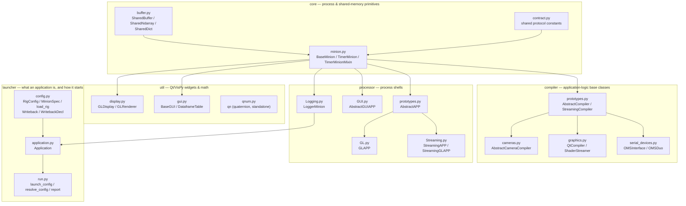
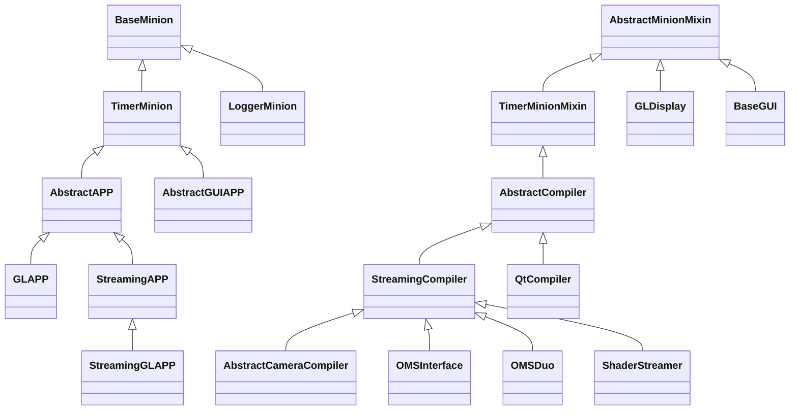

# Architecture

Generated from the actual import graph and class hierarchy (static analysis of `miniPoly/`,
2026-08-13) — not a hand-drawn approximation. Five layers, each depending only on the ones
below it. `tests/test_layering.py` enforces the rule statically, so a violating import
fails a test rather than being noticed later.

## Module dependency graph

`qnum.py` has no internal miniPoly imports — it is pure quaternion math, consumed by the
closed-loop geometry code in the miniPolyApp repo, not by anything inside miniPoly itself.

`launcher` is the one layer *above* `processor`, and the only one with that direction. It
builds a set of APPs, so it must know they exist; what matters is that nothing may import
it back, which is what keeps "how an application is assembled" out of the parts being
assembled. Its single edge into `processor` is `LoggerMinion` — every other APP class is
named as a dotted string in `Application.KINDS` and resolved at build time, so importing
`miniPoly.launcher` pulls in neither PyQt5 nor VisPy. `config.py` has no miniPoly imports
at all: a configuration file can be parsed and validated on a machine with no framework
and no hardware, which is the machine someone debugs a config on.

## Class hierarchy

Three roots converge on `BaseMinion`: every process shell and every compiler is, at bottom,
a minion that ticks, holds shared state and can be linked to peers. `AbstractMinionMixin` is
the lighter-weight second root for widgets (`GLDisplay`, `BaseGUI`) that need minion-style
state access without owning a process lifecycle.

Classes also inherit from external bases not shown above: `QtCompiler`/`BaseGUI` from Qt's
`QMainWindow`, `ShaderStreamer`/`GLDisplay` from VisPy's `Canvas`, `LoggerMinion` from the
stdlib's `logging.handlers.QueueListener`. Those are omitted here since they're framework
plumbing, not part of miniPoly's own design.

## Reading order

1. **`core/buffer.py`** — the shared-memory namespace. Understand this first; everything
   else is built on top of it.
2. **`core/minion.py`** — `BaseMinion` (process lifecycle, state sharing, linking) and
   `TimerMinion` (adds a tick loop). This is the framework's actual API surface.
3. **`compiler/prototypes.py`** — `AbstractCompiler`/`StreamingCompiler`, the base classes
   application code subclasses to declare device- or GUI-specific behavior.
4. **`processor/prototypes.py`** — `AbstractAPP`, the process-shell base that hosts a
   compiler and gives it a real OS process to run in.
5. **`launcher/application.py`** — `Application`, which turns a TOML file naming a set of
   those shells into running processes. Read it last: it composes everything above and
   introduces no new mechanism, only a place to write the composition down.

The roadmap and defect inventory live in the repository, not on this site: see
[PROJECT_OVERVIEW.md](https://github.com/nash-yzhang/miniPoly/blob/main/docs/PROJECT_OVERVIEW.md).
